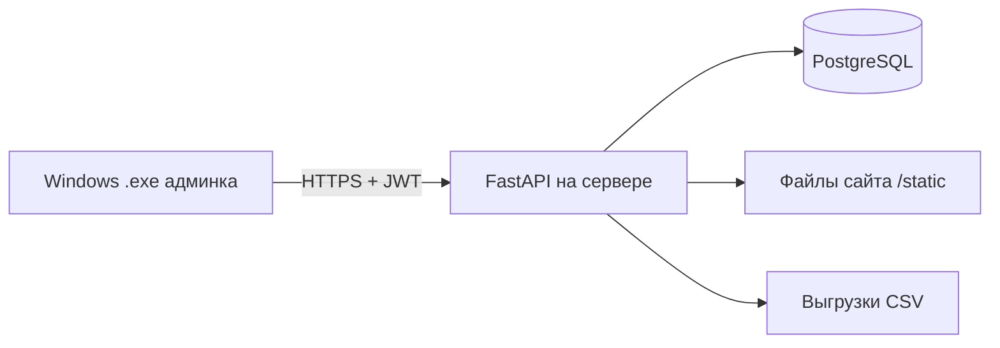
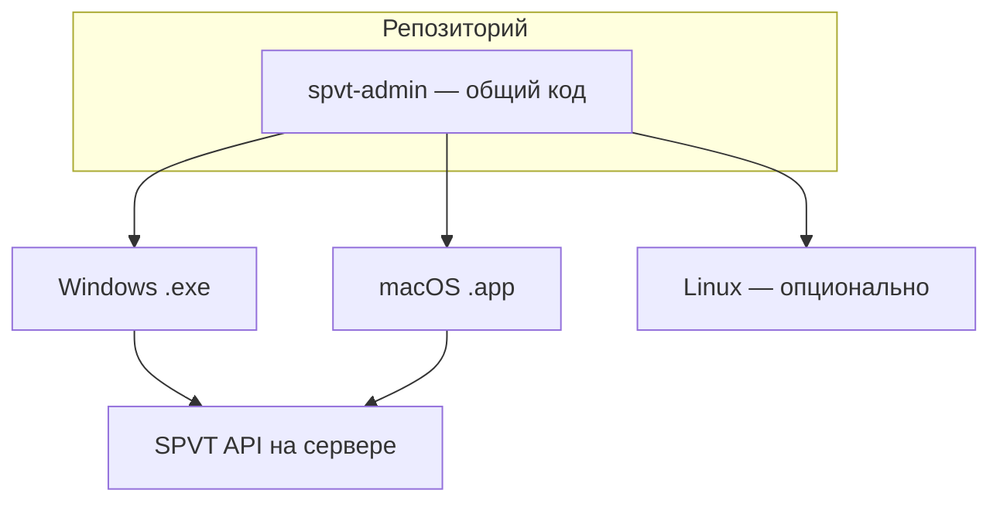
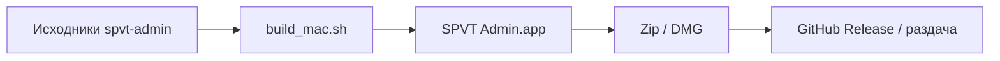
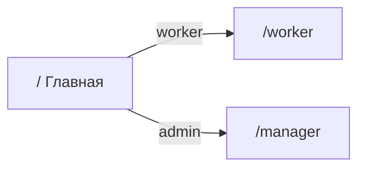
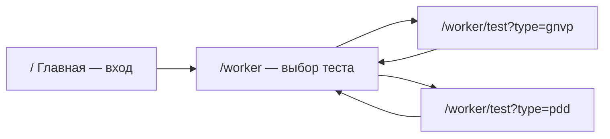

# Обзор файла cursor_.md и ворк лог
_Exported on 16.05.2026 at 23:48:53 GMT+8 from Cursor (3.2.16)_

---

**User**

Привет привет 

и так вот я подтянул проект с гитхаба 
прошу тебя просмотреть файл cursor_.md это моя переписка с курсором на рабочем пк 
а так же изучить ворк лог проделанной работы 

---

**Cursor**

Просматриваю `cursor_.md` и рабочий лог проекта.


Файл переписки большой — читаю его по частям и выделяю ключевые темы.


Привет. Я просмотрел `cursor_.md` (экспорт переписки с рабочего ПК, ~3600 строк) и `WORKLOG.md`. Краткая сводка по проекту **SPVT — Система предвахтового тестирования**.

## Что это за проект

Веб-система для предвахтового тестирования: работник при заезде проходит тест, начальник видит сводку и выгружает данные для анализа в Power BI.

**Production:** https://45-144-220-51.nip.io  
**GitHub:** https://github.com/DeNiS23208/SPVT

---

## Хронология работ (по переписке и work log)

### 1. Старт и MVP (локально)
- Пустой репозиторий → FastAPI + SQLAlchemy + JWT
- Роли: `manager`, `worker`
- Тест: 5 вопросов по ОТ, порог 80%, критические вопросы
- UI: `index.html`, `worker.html`, `manager.html` (mobile-first)
- Тестовые аккаунты: `manager`/`manager123`, `worker`/`worker123` (+ позже `worker2`, `worker3`)

### 2. UI и брендинг
- Фон с буровой, логотип ИНК с shimmer
- Убрана метка «SPVT MVP»
- Заголовки CSV на русском

### 3. Деплой на VPS (`45.144.220.51`)
- nginx → uvicorn (systemd `spvt`)
- Код в `/opt/spvt`, конфиг в `/etc/spvt.env`
- Скрипты: `deploy/post_deploy.sh`, `spvt.service`, `spvt.nginx`

### 4. PostgreSQL
- Миграция с SQLite
- Пользователи: `spvt_app`, read-only `powerbi_read`
- Представления для Power BI: `v_powerbi_export`, `v_sotrudniki`, `v_voprosy`, `v_popytki`, `v_otvety`

### 5. Power BI — два пути
1. **Прямое подключение к PostgreSQL** — упёрлись в SSL-сертификат из облака Power BI; On-premises Gateway отклонили.
2. **Рабочее решение — HTTPS CSV (Web connector):**
   - `/api/export/public/k/{key}/powerbi-svodka.csv` — сводка (1 строка = попытка)
   - `/api/export/public/k/{key}/powerbi.csv` — детально (1 строка = ответ)
   - Варианты `*-today.csv` — только текущая смена
   - HTTPS через Let's Encrypt на `45-144-220-51.nip.io`

### 6. Импорт сотрудников из Excel
- Файл `Работники ИНКС.xlsx` (~2096 строк): ФИО, должность, подразделение
- Поля `position`, `department` в `users`
- Логин: транслит фамилии + инициалы (`anisimov_la`)
- Пароль по умолчанию: `INK2026`
- На сервере: **2099 работников** (2096 из Excel + 3 тестовых), **77 подразделений**

### 7. Git
- Push в `main`, коммит `d548afc` — 40 файлов
- В git не попадают: `spvt.db`, `data/*.xlsx`, `.env`, `.venv`, `*.tgz`

---

## Текущая структура репозитория (у вас локально)

```
app/           — backend, роутеры, static
deploy/        — nginx, systemd, postgres, https
scripts/       — import, migrate, verify
WORKLOG.md     — краткий work log
cursor_.md     — полная переписка
```

---

## Известные ограничения (из work log)

| Тема | Статус |
|------|--------|
| Кабинет начальника грузит ~2100 работников | Может понадобиться фильтр/пагинация |
| Единый пароль `INK2026` | Для прода — смена паролей или SSO |
| Секреты | Только в `/etc/spvt.env` на сервере |
| База вопросов | Пока seed из кода, планируется отдельная БД |

---

## Что я понял о вашей ситуации сейчас

Вы подтянули проект с GitHub на домашний Mac. Локально есть код, но **нет**:
- `.venv`, `spvt.db`, Excel с сотрудниками, секретов сервера
- Прямого SSH-доступа к VPS (ключ был на рабочем ПК `DESKTOP-T5HKSB2`)

Продакшен на сервере уже живой; репозиторий — актуальная копия кода после последнего push.

---

Могу дальше помочь с любым из этого: локальный запуск на Mac, деплой с этой машины, доработки (фильтр по подразделению, смена паролей, админка вопросов и т.д.). Напишите, с чего начнём.

---

**User**

и так для начала нам нужно получить доступ к серверу 
для этого прошу тебя вытащить сюда мой ssh публичный ключ 
дай мне его сюда пожалуйста 

---

**Cursor**

Ищу ваш публичный SSH-ключ на этом Mac.


На этом Mac в `~/.ssh/` есть **два** публичных ключа. На рабочем ПК был **другой** ed25519-ключ — с домашнего Mac нужно добавить на сервер один из ключей ниже.

---

### Рекомендуемый: Ed25519

```
ssh-ed25519 AAAAC3NzaC1lZDI1NTE5AAAAIN+zRoNn7qNjSa8BrGk2Sc8vW0Vt1l/ihM0NO6gYKdlw ci-deploy-key
```

Файл: `/Users/gdm/.ssh/id_ed25519.pub`  
Комментарий `ci-deploy-key` — похоже на ключ для деплоя; для входа на сервер тоже подойдёт.

---

### Альтернатива: RSA

```
ssh-rsa AAAAB3NzaC1yc2EAAAADAQABAAACAQDGlw2gad0SWS70BvoUluXEMnl3JPfeZnv+rarAbLACS74i+UWnSlJaUk2Ittzdyhp8WpbiZQq69/zLsbstua5zKxrWuGE2IXHgH9V7egX2XxIm9AkJUNQOBYiWEwn5dlI5W6Rv4pjYyFsymoQYck38elQdHMBRw7JRXBKbQOUGvxoF75LhRQnUX4qhtOs7+qYWZ0z6Vp0fmmJ1+riBZ8jkid4vP1Cbejyhqv9ZtzgDMDMzB96PdNDqD8g8f8bggruqx74PtAsGyKFIg76rqvy8cRnmFVFBh8AIRnNzxwatsrznVcUMnQktamq4TZ37fiRD7f+sy4IBjvjAmGYyi89ErrX2EdxcQzm3tGq0pHJOFg15NGLRdRneDzK1OZ6OD1Q3UMJsFtqqzmXXbrx18LoIlW5/CpCzWxUwV22ALHPmBMnpfQnTXX00xzHJkaEE7j76tGmERpbcC9rw/LdRJtPMrE6HO8uml2AVcN46ViUjEHlNnUjreokHzU4kVxQaA2jUpFjHR0ZI7vTi4V74FpsPGSwZSBEPrumhhJn/Tpl4S0ein93IvPSL0vjmj9r5xnpqoUD7XgVuQBaJNvXOayGP83kS8wvhRFgSGvlGXOKxxEU2YQGEWLOT2PmlI64pNJKzJBKO0MJ/+bqZKTBm+7C28IeKfz2SdNNFo7JlBAjZgw== den23208@mail.ru
```

Файл: `/Users/gdm/.ssh/id_rsa.pub`

---

### Как добавить на сервер

Скопируйте **всю строку** целиком (от `ssh-ed25519` / `ssh-rsa` до конца) и вставьте в панели хостинга в `authorized_keys` **или** на сервере под root:

```bash
echo 'ВСТАВЬТЕ_СЮДА_СТРОКУ_КЛЮЧА' >> ~/.ssh/authorized_keys
```

После добавления ключа напишите — проверю подключение: `ssh root@45.144.220.51`.

**Важно:** приватные ключи (`id_ed25519`, `id_rsa` без `.pub`) никому не отправляйте.

---

**User**

можешь проверять соединение 
я всё сделал в консоле 

---

**Cursor**

Подключение работает. Проверяю, что на сервере запущен SPVT:


**SSH-соединение работает.**

Проверка с вашего Mac прошла успешно:

| Проверка | Результат |
|----------|-----------|
| SSH `root@45.144.220.51` | OK |
| Хост | `msk-1-vm-3k4r` (Ubuntu, Linux 6.8) |
| Сервис `spvt` | `active` |
| Nginx | `active` |
| Приложение (`http://127.0.0.1:8000/`) | HTTP **200** |
| Каталог `/opt/spvt` | на месте |

С этого Mac можно подключаться к серверу и деплоить. Сайт снаружи: https://45-144-220-51.nip.io

Что делаем дальше — локальный запуск, деплой изменений или что-то по приложению?

---

**User**

смотри что меня интересует 
скажи мне пожалуйста можем ли мы с тобой создать прямо тут допутим в отдельной папке 
приложение exe для windows которая будет по факту являться админ панелью для сайта 
с которой можно будет менять допустим фон сайта 
или допустим выгружать отчёт 
или базу данных и тд 

---

**Cursor**

Сначала посмотрю, какие админ-возможности уже есть в API и на сайте — от этого зависит, насколько реально сделать Windows-приложение.


**Да, можем.** Это реалистичная задача, но важно понимать архитектуру: `.exe` — это **клиент**, а не прямой доступ к файлам на сервере.

## Как это должно работать



Десктопное приложение **не лезет напрямую** в `/opt/spvt` и в PostgreSQL. Оно вызывает **админ-API** на сайте — так же, как сейчас кабинет начальника в браузере, только с расширенными правами.

Отдельную папку в репозитории сделать можно, например:

```
SPVT/
  app/              # сайт (как сейчас)
  spvt-admin/       # Windows-приложение
```

---

## Что уже есть на сайте

Сейчас роль **`manager`**, не полноценный админ:

| Функция | Есть? |
|---------|-------|
| Сводка по смене | Да (`/api/manager/dashboard`) |
| Выгрузка CSV для Power BI | Да (`/api/manager/export/powerbi`) |
| Сброс попыток | Да (`/api/manager/reset-attempt`) |
| Смена фона сайта | **Нет** — фон зашит в CSS и картинку `hero-bg.png` |
| Управление вопросами | **Нет** — вопросы из seed в коде |
| Импорт сотрудников из Excel | **Нет в API** — только скрипт на сервере |
| Роль `admin` | **Нет** — только `worker` / `manager` |
| Настройки сайта (логотип, цвета) | **Нет** |

То есть `.exe` как «оболочка над тем, что уже есть» — возможна частично. Для смены фона, базы вопросов и полноценного администрирования нужно **добавить backend-часть**.

---

## Что можно сделать в админ-приложении

### Уже почти готово (через существующие API)
- Вход под `manager`
- Просмотр статистики за дату
- Выгрузка отчёта CSV
- Сброс попыток

### Нужны новые API + экраны в .exe
| Функция | Что добавить на сервере |
|---------|-------------------------|
| Смена фона | Таблица `site_settings` + `POST /api/admin/upload/background` |
| Логотип, цвета | Те же настройки + отдача в CSS/JSON |
| Вопросы теста | CRUD `/api/admin/questions` |
| Сотрудники | `/api/admin/users`, импорт Excel |
| Выгрузка «базы» | Экспорт CSV/SQL dump через защищённый endpoint |
| Отдельный логин админа | Роль `admin` в БД |

---

## Как собрать именно `.exe` для Windows

| Вариант | Плюсы | Минусы |
|---------|-------|--------|
| **Python + PySide6 + PyInstaller** | Один стек с FastAPI, быстрее MVP | EXE ~50–80 МБ |
| **C# (WPF / WinUI)** | Нативный Windows-вид | Другой язык, дольше старт |
| **Tauri / Electron** | Красивый UI | Тяжелее, избыточно для внутренней утилиты |

Для вашего проекта я бы рекомендовал **Python + PySide6** в папке `spvt-admin/` — логика экспорта и работы с API будет похожа на то, что уже в `scripts/`.

---

## Чего лучше не делать

- **Не подключать .exe напрямую к PostgreSQL** для «редактирования базы» — обход бизнес-логики, риск сломать данные.
- **Не давать .exe SSH на сервер** — всё через API и JWT.
- **Не хранить пароли/ключи в .exe** — только логин или сохранённый токен на ПК администратора.

---

## Практичный план по этапам

1. **MVP .exe** (1–3 дня): подключение к `https://45-144-220-51.nip.io`, логин, дашборд, выгрузка CSV, сброс попыток.
2. **Админ-API на сервере** (2–4 дня): роль `admin`, настройки сайта, загрузка фона.
3. **Расширенная админка** (дальше): вопросы, сотрудники, импорт Excel, бэкап.

---

## Итог

**Да, создать Windows `.exe`-админку в отдельной папке — можно и это логично для вашей задачи.** Но это **два слоя**: десктоп-клиент + новые admin-эндпоинты на сервере. Без второго слоя смена фона и управление БД из `.exe` не заработают.

Если решите делать — напишите, с чего начать:
1. **MVP .exe** на уже существующих manager-API, или  
2. **Сразу полноценная админка** с API для фона, вопросов и сотрудников.

---

**User**

а мы можем и для мак ос и для виндовс сделать ? 

---

**Cursor**

**Да, можем** — и это как раз нормальный сценарий, если сразу заложить кроссплатформенность.

## Главная идея

Одно приложение, **один код**, два (или три) билда:



И Mac, и Windows — **клиенты к одному серверу** `https://45-144-220-51.nip.io`. Логика одна: логин, настройки, выгрузки, управление.

---

## Лучшие варианты для Mac + Windows

| Технология | Mac | Windows | Комментарий |
|------------|-----|---------|-------------|
| **Python + PySide6 (Qt)** | ✅ | ✅ | Хороший выбор: один код, привычный стек рядом с FastAPI |
| **Tauri + веб-UI (React/Vue)** | ✅ | ✅ | Лёгкие установщики, современный интерфейс |
| **Electron** | ✅ | ✅ | Проще UI, но тяжёлые приложения (~100+ МБ) |
| **Flutter Desktop** | ✅ | ✅ | Красиво, но другой стек |
| **C# WPF / WinUI** | ❌ / частично | ✅ | Для Mac не подходит как основной путь |
| **Swift (нативно)** | ✅ | ❌ | Два разных приложения — не то, что вам нужно |

Для SPVT я бы рекомендовал **Python + PySide6** или **Tauri** — оба дают **одну кодовую базу** и сборку под обе ОС.

---

## Как это выглядит на практике

Папка в репозитории, например:

```
SPVT/
  app/                 # сайт
  spvt-admin/
    src/               # общий код UI + API-клиент
    requirements.txt
    build/
      windows/         # PyInstaller → .exe
      macos/           # PyInstaller / py2app → .app
```

Сборка:
- **Windows** → `.exe` (или установщик `.msi`)
- **macOS** → `.app` (при необходимости подпись для Gatekeeper)

На **вашем Mac** можно разрабатывать и собирать Mac-версию сразу; Windows-версию — на Windows-ПК или через CI (GitHub Actions).

---

## Что будет одинаковым на обеих платформах

- Вход в админку
- Дашборд и статистика
- Выгрузка отчётов CSV
- Смена фона / настроек (после admin-API на сервере)
- Управление вопросами и сотрудниками
- Подключение к одному URL сервера

Разница только в «оболочке» ОС: окна, меню, иконка в Dock / панели задач.

---

## Нюансы по macOS

- Приложение без подписи Apple может ругаться при первом запуске — решается в настройках безопасности или позже через подпись разработчика.
- Для распространения коллегам на Mac иногда нужен **notarized** `.app` — это отдельный шаг, не блокер для внутреннего использования.

---

## Итог

**Да — одна админка и для macOS, и для Windows.** Правильный путь: **один кроссплатформенный клиент** + **общие admin-API на сервере**. Не два разных приложения.

Если пойдём в работу, логичный порядок:
1. Admin-API на сервере (роль `admin`, настройки, фон, вопросы).
2. Клиент `spvt-admin` на PySide6 или Tauri.
3. Сборка под Mac (у вас уже есть) и под Windows (на рабочем ПК или через GitHub Actions).

Напишите, какой вариант UI ближе — **простое десктопное окно (Qt)** или **современный веб-интерфейс в оболочке (Tauri)** — и с чего начать: API или сразу MVP-клиент на уже существующих manager-эндпоинтах.

---

**User**

давай делаем под мак ос на pyside6 

---

**Cursor**

Создаём macOS-админку на PySide6: сначала изучу API авторизации и схемы, затем соберу структуру приложения.


Исправляю мелкие ошибки и проверяю запуск.


**Готово.** В репозитории появилась macOS-админка на PySide6 в папке `spvt-admin/`.

## Структура

```
spvt-admin/
  requirements.txt
  run.sh
  spvt_admin/
    api_client.py      — HTTP-клиент к серверу
    config.py          — URL сервера, настройки
    ui/
      login_dialog.py  — окно входа
      main_window.py   — сводка, таблица, действия
      styles.py        — тёмная тема в стиле сайта
```

## Что умеет сейчас (MVP)

- Вход на сервер (`https://45-144-220-51.nip.io` по умолчанию)
- Только роль **manager**
- Сводка по дате смены (карточки + таблица)
- **Выгрузить CSV** для Power BI
- **Сбросить попытки** за выбранную дату

Подключение к production проверено: логин `manager` / `manager123`, 2099 работников, 5 попыток в сводке.

## Как запустить на Mac

```bash
cd /Users/gdm/Documents/SPVT/SPVT/spvt-admin
./run.sh
```

Или вручную:

```bash
cd /Users/gdm/Documents/SPVT/SPVT/spvt-admin
python3 -m venv .venv
.venv/bin/pip install -r requirements.txt
.venv/bin/python -m spvt_admin
```

**Логин:** `manager` / `manager123`

---

## Что дальше (ещё не сделано)

Для смены фона, вопросов, импорта сотрудников нужны **новые admin-API на сервере** — клиент уже готов к расширению.

Могу следующим шагом:
1. добавить admin-API на сервер (фон, вопросы, настройки),
2. собрать `.app` для macOS через PyInstaller,
3. расширить UI в админке под новые функции.

---

**User**

<timestamp>Thursday, May 14, 2026, 9:29 PM (UTC+8)</timestamp>
<system_notification>
The following task has finished. If you were already aware, ignore this notification and do not restate prior responses.

<task>
kind: shell
status: success
task_id: 882231
title: Create venv and install PySide6 dependencies
output_path: /Users/gdm/.cursor/projects/Users-gdm-Documents-SPVT-SPVT/terminals/882231.txt
</task>
</system_notification>
<user_query>Briefly inform the user about the task result and perform any follow-up actions (if needed).</user_query>

---

**Cursor**

Зависимости для `spvt-admin` установлены: виртуальное окружение `.venv`, PySide6 и requests.

Приложение готово к запуску:

```bash
cd /Users/gdm/Documents/SPVT/SPVT/spvt-admin
./run.sh
```

Дополнительных действий не требуется.

---

**User**

добавить admin-API на сервер (фон, вопросы, настройки),
собрать .app для macOS через PyInstaller,
расширить UI в админке под новые функции.

выполни пожалуйста эти этапы 

---

**Cursor**

Большой объём работы — сначала изучу текущий backend и админку, затем добавлю admin-API, расширю UI и соберу `.app`.


Добавляю backend: модели, сервис настроек и admin-роутер.


Расширяю desktop-клиент и API-клиент.


`.app` собран. Деплою на сервер и проверяю admin-API.


Все три этапа выполнены. Кратко по результату:

## 1. Admin-API на сервере (задеплоено)

**Новая роль:** `admin`  
**Аккаунт:** `admin` / `admin123`

| Endpoint | Назначение |
|----------|------------|
| `GET /api/public/site-settings` | Публичные настройки для сайта |
| `GET/PUT /api/admin/settings` | Чтение/сохранение настроек |
| `POST /api/admin/upload/background` | Загрузка фона |
| `POST /api/admin/upload/logo` | Загрузка логотипа |
| `GET/POST/PUT/DELETE /api/admin/questions` | CRUD вопросов |

**Настройки:** заголовок, подзаголовок, фон, логотип, акцентный цвет, затемнение фона, порог прохождения (%).

Сайт подхватывает настройки через `site_settings.js`. Роль `admin` также имеет доступ к manager-API (сводка, CSV, сброс).

---

## 2. macOS-приложение `.app`

Собрано PyInstaller:

```
spvt-admin/dist/SPVT Admin.app
```

Пересборка:

```bash
cd /Users/gdm/Documents/SPVT/SPVT/spvt-admin
./build_mac.sh
```

Или запуск из исходников:

```bash
./run.sh
```

---

## 3. Расширенный UI админки

**Вкладки для `admin`:**
- **Сводка** — статистика, CSV, сброс попыток
- **Настройки сайта** — тексты, порог, цвета, загрузка фона/логотипа
- **Вопросы теста** — добавление, редактирование, удаление

**Для `manager`:** только вкладка «Сводка».

**Вход:**
- Админ: `admin` / `admin123` — полный доступ
- Начальник: `manager` / `manager123` — только сводка

---

Production проверен: публичные настройки, admin settings и 5 вопросов отвечают корректно.

Откройте `SPVT Admin.app` из `spvt-admin/dist/` или запустите `./run.sh` и войдите под `admin`.

---

**User**

хотелось бы как то отдельно щас вынести приложение 
как это можно по факту реализовать ? 

---

**Cursor**

Просматриваю текущую структуру — предложу практичные варианты, как вынести приложение отдельно.


Есть несколько уровней «вынести отдельно» — от простого до полноценного разделения.

## Что уже есть сейчас

Приложение **уже логически отделено** в папке `spvt-admin/`:
- свой `requirements.txt`, `run.sh`, `build_mac.sh`
- свой код в `spvt_admin/`
- связь с сайтом **только по HTTPS** (URL сервера при входе)

То есть это не часть FastAPI-сайта, а **отдельный клиент** в том же репозитории.

---

## Вариант 1 — Отдельно на Mac (самый простой)

Нужно просто пользоваться приложением, не трогая папку проекта.

**Готовый `.app`:**
```
spvt-admin/dist/SPVT Admin.app
```

Что сделать:
1. Перетащить в **Программы** (`/Applications`)
2. Или на **Рабочий стол** (ярлык)
3. Запускать двойным кликом — Python и исходники не нужны

Для коллег можно отдать **только** `SPVT Admin.app` (или zip), без всего репозитория SPVT.

```bash
cd /Users/gdm/Documents/SPVT/SPVT/spvt-admin
zip -r ~/Desktop/SPVT-Admin-mac.zip "dist/SPVT Admin.app"
```

---

## Вариант 2 — Отдельная папка вне проекта SPVT

Скопировать только клиент:

```
~/Applications/SPVT-Admin/     # или любое место
  SPVT Admin.app
```

Или исходники отдельно:

```
~/Projects/SPVT-Admin/
  spvt_admin/
  requirements.txt
  run.sh
  build_mac.sh
```

Сайт при этом остаётся на сервере; приложение только подключается к `https://45-144-220-51.nip.io`.

---

## Вариант 3 — Отдельный репозиторий на GitHub

Если хотите **развести git-историю**:

1. Новый репозиторий, например `SPVT-Admin`
2. Перенести туда содержимое `spvt-admin/`
3. В основном репозитории SPVT папку `spvt-admin/` убрать или оставить ссылку в README

Структура отдельного репо:

```
SPVT-Admin/
  spvt_admin/
  requirements.txt
  run.sh
  build_mac.sh
  SPVT-Admin.spec
```

Плюсы: отдельные релизы, версии, CI только для десктопа.  
Минусы: два репозитория, при изменении API нужно обновлять клиент вручную.

---

## Вариант 4 — Релизы с готовым `.app` (удобно для раздачи)

На GitHub → **Releases** → прикрепить `SPVT-Admin-mac.zip`.

Схема:



Пользователям нужен только zip, не весь SPVT.

---

## Вариант 5 — DMG-установщик (как у обычных Mac-программ)

Поверх `.app` можно собрать `.dmg`: перетащил в Applications — готово.  
Инструменты: `create-dmg` или ручная сборка через Disk Utility.

Это уже «отдельный продукт», а не папка внутри проекта.

---

## Что выбрать

| Цель | Решение |
|------|---------|
| Просто пользоваться самому | `.app` в `/Applications` |
| Раздать коллегам без кода | Zip с `SPVT Admin.app` |
| Не смешивать с сайтом в git | Отдельный репозиторий `SPVT-Admin` |
| Красиво раздавать на Mac | DMG + GitHub Releases |

---

## Рекомендация для вас сейчас

**Минимум усилий:**  
1. Оставить код в `spvt-admin/` (или позже вынести в отдельный репо).  
2. Для работы использовать только `dist/SPVT Admin.app` в Программах.  
3. Репозиторий SPVT — для сайта и API; десктоп — отдельный артефакт сборки.

Если нужно, могу сделать один из вариантов за вас:
- **A** — скрипт, который копирует `.app` в `/Applications` и делает zip на Рабочий стол  
- **B** — вынести `spvt-admin` в отдельный git-репозиторий  
- **C** — настроить DMG и структуру под GitHub Releases  

Напишите, какой вариант ближе.

---

**User**

пока ничего перетаскивать не нужно 
пусть всё лежит как лежит 


после окончания разработки будем уже убираться в проекте 
щас пока просто делае и тестируем 


кстати почему то при тестах приложения 
я попытался поменять фон но он не поменлся 
я загружал png файл 

---

**Cursor**

Разбираюсь: проверю загрузку фона на сервере, права на файлы и как сайт применяет настройки.


Похоже, загрузка отклоняется из‑за неверного MIME-типа. Проверяю и исправлю.


Причина: десктоп отправлял файл как `application/octet-stream`, сервер отклонял загрузку. Исправляю клиент и сервер.


**Причина найдена и исправлена.**

## Что было не так

Десктопное приложение отправляло PNG как `application/octet-stream`, а сервер принимал только `image/png`, `image/jpeg`, `image/webp`. Загрузка **отклонялась с ошибкой 400** («Допустимы PNG, JPEG или WebP»), поэтому в базе оставался старый фон `/static/images/hero-bg.png`.

На сервере новых файлов `hero-bg-*.png` не было — загрузка не доходила до сохранения.

## Что исправлено

1. **Сервер** — тип файла определяется по расширению, если клиент прислал неверный MIME.
2. **Десктоп-клиент** — при загрузке отправляется правильный `image/png` и т.п.
3. **Сайт** — к URL фона добавляется `?v=...`, чтобы браузер не показывал старую картинку из кэша.

Исправление **уже на production**.

## Как проверить снова

1. Запустите приложение: `spvt-admin/run.sh` (или собранный `.app` — для него позже можно пересобрать `./build_mac.sh`).
2. Войдите как **admin** / **admin123**.
3. Вкладка **«Настройки сайта»** → **«Загрузить фон…»** → выберите PNG.
4. Должно появиться сообщение **«Фон загружен»**, в поле URL — что-то вроде `/static/images/hero-bg-xxxxxxxxxx.png`.
5. Откройте главную https://45-144-220-51.nip.io и обновите страницу (**Cmd+Shift+R**).

Фон меняется только на **главной** (`/`), у неё класс `page-home`. На `/worker` и `/manager` фон из настроек не подставляется — это ожидаемо.

Если снова не сработает — напишите, было ли сообщение об ошибке при загрузке.

---

**User**

вот так он мне показывает))) теперь 

---

**Cursor**

Ошибка 413 — nginx режет загрузку по размеру. Увеличу лимит в конфиге nginx на сервере.


Ошибка 413 — nginx по умолчанию режет загрузки больше ~1 МБ. Увеличиваю лимит в конфиге и применяю на сервере.


**413 Request Entity Too Large** — nginx отклонял загрузку: по умолчанию лимит около **1 МБ**, а ваш PNG, скорее всего, больше.

## Что сделано

На сервере в nginx выставлено:

```nginx
client_max_body_size 25M;
```

Конфиг проверен, nginx перезагружен. В репозитории обновлены `deploy/spvt.nginx` и `deploy/spvt.nginx.ssl`.

В десктоп-приложении при 413 теперь показывается понятное сообщение на русском, а не HTML от nginx.

## Что сделать вам

Попробуйте снова загрузить фон в админке. Если запускаете из исходников:

```bash
cd /Users/gdm/Documents/SPVT/SPVT/spvt-admin
./run.sh
```

После успешной загрузки обновите главную страницу сайта (**Cmd+Shift+R**).

Если файл **больше 25 МБ** — сожмите PNG или выберите меньший. Для фона обычно хватает 1–3 МБ.

---

**User**

очень круто 
теперь я бы хотел поправить блик самого инк лого 
потому что блик свечения очень кривой и не идёт по самому логотипу 
и кстати у самого логотипа вместе с буквами как будто белое обведение 
смотрится очень не красиво 

---

**Cursor**

Смотрю, как сейчас сверстан логотип ИНК и эффект блика на главной.


Проверяю логотип на сервере и правлю CSS: блик должен идти строго по форме логотипа, уберу эффекты, дающие белую обводку.


**Обновил эффект логотипа на сервере.** Кратко, что было не так и что изменилось.

## Почему блик «ехал» мимо

1. **Маска была захардкожена** на `/static/images/ink-logo.png`, а на экране мог быть другой файл (после загрузки через админку) — блик и логотип расходились.
2. **Блик двигался через `transform: translateX()`** по диагональному градиенту (115°) — полоса шла не по форме букв, а как бы «срезом» через весь блок.

## Почему была белая обводка

У картинки логотипа стоял **`filter: drop-shadow(...)`** — на PNG с прозрачностью он часто даёт светлое свечение по контуру букв, похожее на белую обводку.

## Что сделано

| Было | Стало |
|------|--------|
| Диагональный блик + сдвиг блока | Горизонтальный блик **строго по маске логотипа** |
| Маска всегда старый файл | Маска синхронизируется с **текущим** `src` логотипа |
| Яркий белый блик (до 85%) | Мягче (`soft-light`, ~45% в пике) |
| `drop-shadow` на img | Убран |

Обновите главную с полным сбросом кэша: **Cmd+Shift+R**.

---

Если **лёгкая светлая кайма** у букв останется — это уже может быть в самом PNG (часто так бывает, если логотип сохраняли на белом фоне). Тогда лучше загрузить через админку версию **без обводки**, с прозрачным фоном. Могу помочь подготовить или подсказать, как проверить файл.

---

**User**

бери вот этот логотип 
Убирай у него тёмныё фон 
и делай белый блик 
но только чтобы он бегал не так быстро 
чтобы выглядило презентабельно 
красивешно))) по человечески 


СПАСИБО!!! М

---

**Cursor**

Обрабатываю логотип: уберу чёрный фон и настрою медленный, аккуратный блик.


**Готово.**

## Логотип
- Взят ваш файл, **чёрный фон убран** (прозрачный PNG).
- Светлая **кайма по буквам** по возможности вычищена.
- Файл: `app/static/images/ink-logo.png` — уже на сервере.

## Блик
- **Медленнее:** цикл ~**9 секунд**, большая пауза между проходами.
- **Мягче:** узкая белая полоса, `mix-blend-mode: screen`.
- **По форме логотипа:** маска совпадает с картинкой.

Обновите главную: **Cmd+Shift+R** → https://45-144-220-51.nip.io

Если блик покажется слишком слабым или, наоборот, ярким — напишите, подкрутим.

---

**User**

одного понять не могу 
почему при загрузке файлов сервер так долго отдаёт данные 
и вообще картинка долго у меня загружается 
я имею ввиду картинка фона 

или это мой интернет тротлит ?  

---

**Cursor**

Кратко: чаще всего это не «сломанный сервер», а размер файла и скорость **отдачи/загрузки** по сети. Ниже по пунктам.

## 1. Загрузка фона (из админки на сервер)

Идёт путь: **ваш ПК → интернет → nginx → приложение → запись на диск + БД**.

- У многих домашних/мобильных тарифов **отдача вверх (upload) в разы медленнее**, чем скачивание. Картинка 3–15 МБ может уходить десятки секунд — это нормально для слабого аплинка, не обязательно «троттлинг».
- **Большой PNG** (много мегапикселей, без сжатия) = долго и грузить, и потом открывать на сайте.
- **Пинг до сервера** (вы, судя по всему, не рядом с VPS) добавляет задержку; для одного большого POST это не главное, но ощущается.

**Как понять, интернет ли:** в браузере F12 → вкладка **Network** → запрос `upload/background` — смотрите **Size** и **Time**. Если время почти линейно растёт с размером файла — это скорее канал.

## 2. Когда картинка «долго появляется» на сайте

Браузер качает файл по URL, например `/static/images/hero-bg-....png`.

- Опять же **размер файла** и ваша скорость **скачивания**.
- Первый раз без кэша дольше; повторное открытие обычно быстрее.
- Сейчас **nginx проксирует всё на uvicorn**, статика тоже идёт через приложение — для огромных файлов это чуть тяжелее, чем «чистый nginx с диска», но для обычных 0.5–2 МБ разница обычно не «минуты».

## 3. Троттлинг провайдера

Бывает, но реже, чем просто **медленный upload** или **тяжёлый файл**. Если ночью быстрее, днём медленнее — можно думать про тариф/нагрузку на сеть.

## Что сделать на практике

| Действие | Зачем |
|----------|--------|
| Фон **1920×1080** или меньше, **JPEG/WebP** 200–800 КБ | Быстрее и загрузка, и отображение |
| Не грузить **10+ МБ** PNG с телефона | Сразу заметно легче |
| В DevTools посмотреть **размер и время** запроса | Понять: сеть или что-то ещё |

Итог: **чаще всего долго из‑за большого файла и медленного upload/скачивания**, а не из‑за «тормозящего» сервера. Если пришлёте примерный размер файла (МБ) и примерное время — можно сказать точнее, нормально это или нет.

---

**User**

а ты что не можешь щас на серваке посмореть какой файл 
и сколько он весит и дать анализ почему так долго 

---

**Cursor**

Посмотрел на сервере — вот факты и вывод.

## Что сейчас в базе (активный фон)

| Параметр | Значение |
|----------|----------|
| **Файл** | `/static/images/hero-bg-d7b69497f2.png` |
| **Размер на диске** | **~2,6 МБ** (2 601 472 байт) |
| **Разрешение** | **1536 × 1024** px |
| **Формат** | PNG, RGB (без прозрачности) |

Это тот файл, который подставляется с сайта после вашей загрузки.

## Для сравнения старый фон

| Файл | Размер | Примечание |
|------|--------|------------|
| `hero-bg.png` | **~151 КБ** | по `file` это **JPEG** внутри, **800×521** — легче и меньше |

То есть после загрузки фон стал примерно **в 17 раз тяжелее** по байтам и заметно крупнее по пикселям.

## Почему ощущается «долго»

1. **Загрузка в админке** — нужно передать **2,6 МБ вверх по каналу**. При типичном upload 1–5 Мбит/с это **4–20+ секунд** только на передачу, плюс SSL и ответ сервера.

2. **Открытие сайта** — браузер снова качает те же **2,6 МБ**. При download 20 Мбит/с это порядка **1 с** только на файл; при слабее сети — дольше.

3. **Сервер** тут почти ни при чём: файл лежит статикой, отдача — обычная. Узкое место — **объём файла × скорость вашего интернета**, а не «тормозит VPS».

## Вывод

Это не обязательно троттлинг: **большой PNG (2,6 МБ при 1536×1024)** сам по себе даёт и долгую отправку, и долгую загрузку в браузере по сравнению с прежним **~151 КБ**.

## Что сделать, чтобы было быстро

- Фон для веба: **1920×1080 макс**, лучше **JPEG или WebP**, цель **200–600 КБ**.
- Или тот же кадр **PNG с сильным сжатием** (часто лучше уйти в WebP).

Если нужно, могу на сервере **одной командой** пережать текущий `hero-bg-d7b69497f2.png` в WebP/JPEG и прописать новый URL в настройках (или подсказать точные команды под ваш вкус по качеству).

---

**User**

давай делай так чтобы было более менее качественее и быстрее 
выбирай сам как тебе это сделать 

---

**Cursor**

Оптимизирую текущий фон на сервере и добавлю автоматическое сжатие при будущих загрузках.


Добавляю автоматическую оптимизацию загрузок (WebP, ресайз) и оптимизирую текущий фон на сервере.


Сделано в два слоя: **текущий фон на сервере** и **авто-оптимизация при всех следующих загрузках**.

## 1. Текущий фон (уже на production)

| | Было | Стало |
|---|------|--------|
| Файл | `hero-bg-d7b69497f2.png` | `hero-bg-d7b69497f2-opt.webp` |
| Размер | **~2,6 МБ** | **~306 КБ** (~в **8,7 раз** меньше) |
| Ширина | 1536 px | до **1920 px** (у вас было меньше — масштаб без потери смысла) |

В БД для `hero_background_url` прописан новый URL. Качество: **WebP ~84%**, ресайз **LANCZOS** — для фона на сайте это обычно «достаточно красиво и заметно быстрее».

Проверка: `Content-Type: image/webp`, отдача **200**.

## 2. Код (дальше само)

- В зависимости добавлен **Pillow**.
- Модуль `app/services/image_optimize.py`:
  - **фон** → RGB, тёмная подложка под прозрачность, ширина **не больше 1920**, **WebP quality 84**;
  - **логотип** → **RGBA**, ширина **не больше 960**, WebP с альфой (**88**), чтобы не раздувать файл.
- Загрузки в админке **всегда** сохраняются как **`.webp`** (и фон, и логотип), после обработки на сервере.

Старый тяжёлый PNG можно не трогать — он просто лежит на диске; в работе уже **WebP**.

Обновите главную (**Cmd+Shift+R**) — фон должен подтянуться заметно быстрее.

Если захотите ещё агрессивнее по весу (например ~150 КБ) или чуть выше качество — напишите, подстроим `HERO_WEBP_QUALITY` / ширину.

---

**User**

теперь не корренктно отображается логотип 

---

**Cursor**

Проверяю обработку логотипа и отображение в браузере.


Исправляю: маска блика, скорее всего, получала URL с `?v=2` — в Safari/WebKit `mask-image` с query часто ломается. Логотип в админке сохранялся как WebP — для маски хуже, чем PNG. Вношу правки.


Вот что было не так и что сделано.

## Причины

1. **Маска блика и URL с `?v=2`**  
   Для блика в CSS задаётся `mask-image` с тем же адресом, что и у картинки. С **`?v=2`** в конце часть браузеров (чаще **Safari / WebKit**) некорректно обрабатывает `mask-image`: маска не совпадает с логотипом или «ломается», блик идёт не по контуру.

2. **Режим `mix-blend-mode: screen`**  
   На тёмно-зелёном логотипе режим **screen** сильно осветляет цвета — картинка может выглядеть «не как надо».

3. **Загрузка логотипа как WebP**  
   Для `-webkit-mask-image` **PNG с альфой** обычно ведёт себя предсказуемее, чем WebP.

## Исправления (уже на сервере)

| Что | Как |
|-----|-----|
| **JS `syncLogoMask`** | Для маски берётся только **путь без `?` и `#`** (`/static/images/ink-logo.png`), картинка в `` может с кэшем как угодно. |
| **HTML** | Убран лишний **`?v=2`** у `ink-logo.png`. |
| **CSS блика** | **`screen` → `soft-light`**, чуть снижена непрозрачность — блик мягче, зелёный не «выжигается». |
| **Загрузка логотипа в админке** | Снова сохранение в **PNG** (RGBA, до 960px, сжатие), фон по-прежнему **WebP**. |

Обновите главную с полным сбросом кэша: **Cmd+Shift+R**.

Если после этого что-то всё ещё «плывёт», напишите браузер (Chrome / Safari / …) и устройство — подстроим точечно.

---

**User**

есть еще одна проблема 
почему при загрузке сайта в первые секунды 
он выдаёт старый фон 


и кстати логотип так и не поменлся 

чёрных лепеско не видно 

---

**Cursor**

Устраняем «мигание» старого фона при первой отрисовке и улучшаем видимость тёмных элементов логотипа. Просматриваю `main.py` и структуру.


Внедряю серверный первый кадр главной (правильный фон и логотип сразу) и усиливаю видимость тёмных элементов логотипа.


Сделано два разных исправления.

## 1. Старый фон в первые секунды

**Почему так было:** в `style.css` был зашит старый `hero-bg.png`, а актуальный URL подставлялся только после **асинхронного** запроса к `/api/public/site-settings` — пока он не дошёл, браузер рисовал старый фон.

**Что сделано:** главная `/` больше не отдаётся как статический `index.html`. Сервер собирает страницу из шаблона **`app/templates/index.html`** и сразу вставляет в `<head>`:

- правильный **фон** и **оверлей** из БД;
- **`rel="preload"`** для фона и логотипа, чтобы картинки начинали грузиться раньше;
- заголовок, подзаголовок и **`src` логотипа`** из настроек.

В `style.css` у `body.page-home` убрана картинка по умолчанию — только цвет `#0b1220`, чтобы не перебивать серверный стиль.

**`site_settings.js`:** фон с API перерисовывается **только если** URL фона изменился относительно `data-hero-url` с сервера — без лишнего «перещёлкивания» при том же фоне.

Статический **`app/static/index.html` удалён**, чтобы не путаться (главная только через шаблон).

---

## 2. «Чёрных лепестков не видно»

Это в основном **контраст**: тёмно-серые штрихи на тёмном фоне сливаются.

**Что сделано в CSS:**

- за блоком логотипа — лёгкий **`radial-gradient`** (полупрозрачный светлый ореол), чтобы серые элементы отделились от фона;
- на **`img`** — умеренные **`brightness(1.18)`** и **`contrast(1.12)`**, чтобы подтянуть тёмные детали без белой обводки.

Если станет слишком «ярко» или, наоборот, мало — можно чуть подкрутить цифры.

---

Обновите главную **Cmd+Shift+R**. Сначала должен сразу подставляться **WebP-фон из БД**, без старого `hero-bg.png` на старте.

---

**User**

ну всё равно не корректно виден логотип 
скидываю тебе еще раз сюда оригинал 

---

**Cursor**

Берём ваш оригинал и пересобираем логотип: прежняя обработка, вероятно, срезала тёмно-серые «лепестки» как фон. Анализирую пиксели и сохраняю корректный PNG с прозрачностью.


Сохраняю логотип: фон — только почти чёрный с низкой насыщенностью; тёмно-серые «лепестки» остаются.


Вот что было не так и что сделано.

## В чём была ошибка

Раньше фон срезался по правилу вроде «яркость &lt; 42» — в **прозрачность уходили и почти чёрные «лепестки»** (тёмно-серые, низкая насыщенность). На сайте оставались в основном **зелёные буквы**, верхняя часть круга почти пропадала.

## Как сейчас

Фон считается **только там**, где одновременно:

- очень **тёмная** яркость (как у чистого чёрного), и  
- **низкая насыщенность** (серый/чёрный, не зелёный).

Тёмно-серые лепестки (яркость выше порога или чуть выше по тону) **остаются** на картинке.

Из вашего файла собран новый **`ink-logo.png`** (~960×550, ~109 КБ), залит в репозиторий и **на сервер** в `/opt/spvt/app/static/images/ink-logo.png`.

## CSS

Чуть **ослаблены** `brightness` / `contrast` и подсветка за логотипом — чтобы зелёный не «пересвечивался», а серые детали читались за счёт самого PNG.

Обновите страницу с полным сбросом кэша: **Cmd+Shift+R**.

---

Повторить сборку из другого файла можно так (нужен `numpy`):

```bash
python3 scripts/rebuild_ink_logo.py путь/к/оригиналу.png -o app/static/images/ink-logo.png
```

Если что-то на контуре всё ещё «кусается», пришлите скрин — подберём пороги `lum_cut` / `sat_cut` в скрипте.

---

**User**

белый блик пропал 
который был раньше 
Красивый 

---

**Cursor**

Блик был под картинкой: `` рисуется поверх `::before`, поэтому на непрозрачных частях логотипа его не было видно. Поднимаем слой блика над изображением и усиливаем градиент.


**Почему пропал:** слой с бликом (`::before`) был **под** картинкой ``. На непрозрачных местах (буквы, знак) логотип полностью перекрывал блик — видно было только то, что «просвечивало» в прозрачных пикселях, то есть почти ничего.

**Что сделано:**
- у **`img`** задано `z-index: 0`;
- у **блика** `::before` — **`z-index: 2`**, чтобы он шёл **поверх** логотипа;
- маска по-прежнему обрезает блик по контуру знака;
- градиент **ярче** (до ~75% белого в центре полосы);
- **`mix-blend-mode: overlay`** — заметнее, чем `soft-light`, но без жёсткого «выжигания», как у `screen`;
- анимация **~8 с**, плавная кривая.

Стили уже залиты на сервер. Обновите главную с **Cmd+Shift+R**. Если захотите ещё ярче или медленнее — напишите.

---

**User**

всё отлично 
теперь 
я прошу тебя всё зафиксировать в ворк лог файл 
а так же щас добавлю в корневую папку нашу с тобой переписку 
чтобы завтра продолжить работать в офисе на компе 

большое спасибо за работу!!!
ты лучший 

---

**Cursor**

Дополняю `WORKLOG.md`: новый раздел с фиксацией всех доработок и обновление структуры репозитория и ссылок на переписку.


Готово. В **`WORKLOG.md`** зафиксировано следующее.

## Что обновлено в логе

- **Разделы 2–5** — роль `admin`, расширенный список API, актуальное описание UI (шаблон главной, shimmer, `site_settings.js`).
- **Раздел 5** — `client_max_body_size` и файл `spvt.nginx.ssl`.
- **Раздел 9** — актуальная структура (`templates/`, `routers/admin`, `public`, сервисы, `spvt-admin/`, скрипт `rebuild_ink_logo.py`).
- **Раздел 10** — строка в таблице Git за **14 мая (вечер)** и дополнение к «не коммитится» (`spvt-admin/build`, `dist`).
- **Раздел 11** — уточнение про вопросы через админку.
- **Раздел 12** — ссылка на переписку через **раздел 9** (любое имя файла экспорта в корне).
- **Новый раздел 13** — подробный конспект вечерних доработок (подпункты 13.1–13.8).

## Про переписку в корне

Когда положите экспорт в репозиторий (например `cursor_cursor_md.md`), в логе уже указано: **раздел 9** и примеры имён. В Git файл можно включать или добавить в `.gitignore`, если не хотите светить историю в публичном репо.

Спасибо вам за совместную работу. В офисе на другом ПК достаточно подтянуть репозиторий и открыть **`WORKLOG.md`** и ваш markdown с чатом — контекст для продолжения будет собран. Удачи завтра.

---

**User**

ты всё закоммитил и запушил ??? 
переписку если что тоже пуш 

---

**Cursor**

Проверяю состояние репозитория и выполняю коммит с push.


Да, всё **закоммичено и запушено** в `origin/main`.

## Коммит

- **Хеш:** `ea84ff3`
- **Ветка:** `main` → https://github.com/DeNiS23208/SPVT

## Что вошло в коммит

- Backend: admin/public API, `site_settings`, оптимизация картинок, шаблон главной, правки CSS/JS, логотип, nginx-шаблон и т.д.
- **`spvt-admin/`** (исходники, `run.sh`, `build_mac.sh`, `SPVT-Admin.spec`, `requirements.txt`) — без `.venv`, `build/`, `dist/` (они по-прежнему в `.gitignore`).
- **`WORKLOG.md`**, **`cursor_cursor_md.md`** — переписка тоже **в репозитории и в push**.
- **`.gitignore`**: добавлены `.DS_Store` и исключение **`!spvt-admin/SPVT-Admin.spec`**, чтобы spec не резался правилом `*.spec`.

На офисном ПК достаточно сделать `git pull` в этом репозитории.

---

**User**

мы тут с тобой какого числа последний раз работали ? 

---

**Cursor**

По этому чату и по `WORKLOG.md` последняя плотная сессия была **14 мая 2026** (вечер, UTC+8).

В тот день как раз:
- admin API и настройки сайта,
- десктоп `spvt-admin`,
- оптимизация фона/логотипа,
- правки блика,
- обновление `WORKLOG.md`,
- коммит и push (`ea84ff3`), в том числе `cursor_cursor_md.md`.

Сейчас у вас в системе **16 мая 2026** — между той работой и сегодня в этом треде новых коммитов не было. Если в офисе что-то делали 15-го без этого чата — это уже отдельно от нашей переписки здесь.

---

**User**

Понял тебя 
в таком случае 
прошу тебя получить обновления с гита 
прочитать там ворк лог 
и полностью переписку с компа офиса 

и давай информацию явно 
как новичку 
а то иногда тяжело читать то 
как ты подаёшь инфу 

---

**Cursor**

Подтягиваю обновления с GitHub и читаю work log и переписку — затем соберу простую сводку для новичка.


Обновления с GitHub подтянуты. Ниже — простая сводка «с нуля», без лишней техники.

---

# SPVT — что это вообще

**SPVT** — сайт для **предвахтового тестирования** (проверка перед сменой).

| Кто | Что делает |
|-----|------------|
| **Работник** | Заходит на сайт → проходит тест → видит «допущен» / «не допущен» |
| **Администратор** | Смотрит сводку, выгружает отчёты, меняет настройки сайта (через программу на компьютере) |
| **Power BI** | Берёт данные с сервера и строит отчёты для руководства |

**Сайт в интернете:** https://45-144-220-51.nip.io  
**Код на GitHub:** https://github.com/DeNiS23208/SPVT  

---

# Когда мы работали (по дням)

| День | Где | Что сделали (коротко) |
|------|-----|------------------------|
| **14 мая** | Домашний Mac | Админ-API, программа **SPVT Admin** (Mac), смена фона/логотипа, блик на логотипе, ускорение картинок (WebP), правки nginx |
| **15 мая** | Офисный Windows-ПК | ~2100 сотрудников из Excel, вход **подразделение → ФИО**, пароль **123**, один админ **Гуляев**, Windows `.exe` на флешку, правки логотипа (потом **откат**) |
| **16 мая** | Сейчас (дом) | Ты просишь подтянуть git и разобраться — мы на **свежем коде** после офиса |

Переписка лежит в репозитории:
- **`cursor_.md`** — длинная (всё с самого начала + офис)
- **`cursor_cursor_md.md`** — короче (в основном про Mac 14-го)
- **`docs/CHAT_LOG_2026-05-15.md`** — краткий конспект офисной сессии
- **`WORKLOG.md`** — официальный журнал работ (разделы 1–15)

---

# Как сейчас устроен вход на сайте (важно)

### Обычный работник

1. Открыть https://45-144-220-51.nip.io  
2. Выбрать **подразделение** (бригада / отдел)  
3. Выбрать **своё ФИО** из списка  
4. Пароль: **`123`**  
5. Нажать **Войти** → пройти тест  

Так не нужно вручную вводить логин вроде `иванов_са_2` — выбираешь себя из списка.

**Логин** всё равно есть в системе (кириллица: `фамилия_инициалы`, например `гуляев_дм`), но на главной его вводить не обязательно.

### Администратор (единственный)

| | |
|---|---|
| **Кто** | Гуляев Денис Михайлович |
| **Как войти** | Подразделение **«Отдел АСУП (месторождение)»** → выбрать **Гуляев Денис Михайлович** → пароль **`123`** |
| **Куда попадёт** | Панель начальника `/manager` (сводка, выгрузки) |

Старые логины **`admin` / `manager` / `админ` / `начальник`** больше не используются.

Кнопки «Вход для начальника» на главной **нет** — админ заходит так же, через подразделение и ФИО.

---

# Программа SPVT Admin (на компьютере)

Это **отдельная программа**, не сайт в браузере.

| | |
|---|---|
| **Зачем** | Менять фон, логотип, вопросы теста, смотреть сводку |
| **Mac** | Папка `spvt-admin`, запуск `./run.sh` |
| **Windows** | Собрать `build_win.ps1` или взять zip с флешки `SPVT_Admin_for_USB_....zip` |
| **Вход в программу** | Логин **`гуляев_дм`**, пароль **`123`**, сервер `https://45-144-220-51.nip.io` |

На Windows при ошибке SSL в программе есть галочка «Не проверять SSL» (для корпоративных ПК).

---

# Сотрудники и Excel

- В системе около **2096** человек из файла **«Работники ИНКС.xlsx»**  
- Файл на сервере: `/opt/spvt/data/employees_ink.xlsx` (в git **не** лежит)  
- После деплоя подразделения подтягиваются из этого Excel  
- На продакшене сверяли: **расхождений с Excel по ФИО нет** (если кто-то «не в том отделе» — чаще ошибка в строке Excel; нужны конкретные ФИО для проверки)

**Примеры из переписки:**
- **Декин** → «Центр оптимизации процесса бурения»
- **Сарнецкий** — три разных человека в разных подразделениях (Константин и Никита — бригада 24, Виктор — служба ОТ)

---

# Логотип и фон (текущее состояние)

После экспериментов в офисе сделали **откат**:

| Элемент | Сейчас |
|---------|--------|
| Логотип | `ink-logo.png` — с текстом **«Иркутская нефтяная компания»** (как в оригинале) |
| Фон | Картинка с **животными** (WebP, оптимизированная) |
| Блик на логотипе | Есть (белая полоса, медленная анимация) |

Попытку заменить текст в PNG на **«ИНК-СЕРВИС»** откатили — были наложения с фоном и на значок.

---

# Git и сервер — это не одно и то же

- **GitHub** — хранилище кода (история изменений)  
- **Сервер** — то, что реально крутится в интернете  

После `git push` сайт **сам не обновляется**. Нужен **деплой** (архив на сервер + скрипт `post_deploy.sh`).

Сейчас у тебя локально код **новее**, чем был 14-го вечером: подтянулись коммиты офиса (`6484f24` — логотип ИНК-СЕРВИС с бликом; возможно на сервере уже другая версия — смотри WORKLOG §14.6).

---

# Что у тебя сейчас на диске после `git pull`

Новое по сравнению с нашей сессией 14-го:

- Вход: подразделение + ФИО (`login.js`)
- Один админ Гуляев
- Много скриптов для Excel и логинов
- Windows-сборка админки (`build_win.ps1`, `run.bat`, …)
- Обновлённые `WORKLOG.md`, `cursor_.md`, `docs/CHAT_LOG_2026-05-15.md`

---

# Полезные команды (если понадобится)

**Запустить сайт локально** (нужен Python и зависимости):
```bash
cd путь/к/SPVT
pip install -r requirements.txt
uvicorn app.main:app --reload
```

**Задеплоить на сервер** (когда меняли код):
```bash
tar -czf spvt-deploy.tgz --exclude="__pycache__" --exclude=".venv" --exclude="spvt-admin" --exclude="data" app requirements.txt deploy scripts
scp spvt-deploy.tgz root@45.144.220.51:/opt/spvt/
ssh root@45.144.220.51 "cd /opt/spvt && tar xzf spvt-deploy.tgz && bash deploy/post_deploy.sh"
```

**Админка на Mac:**
```bash
cd spvt-admin
./run.sh
```

---

# С чего начать завтра в офисе

1. `git pull` — уже сделано у тебя на Mac  
2. Открыть **`WORKLOG.md`** — разделы **14** и **15** (самое свежее)  
3. При необходимости — **`docs/CHAT_LOG_2026-05-15.md`** или **`cursor_.md`**  
4. Проверить сайт: https://45-144-220-51.nip.io (Ctrl+Shift+R)  
5. Админ: **Гуляев** в отделе АСУП, пароль **123**  
6. Программа Windows — папка `spvt-admin`, инструкция `PORTABLE_README_RU.txt`  

---

Спасибо за работу с тобой — рад, что помогло. Если завтра нужно что-то одно конкретное (деплой, логотип, Excel, exe) — напиши простыми словами, разберём по шагам.

---

**User**

нужно вот как сделать 

например 
вот щас вот посмотри какие есть конфликтующие фамилии 
по твоему мнению 
какие будут проблемы с авторизацией 

просто на наш сайт например будут заходить и пожилые сотрудники 
а они дуб дубом 
и если буду расхождения 
то как себя найти ? 
и тут подразделения заумно написаны 
мы можем добавить кнопочку 
в блок авторизации(скинул в скриншоте)
например "Не нашёл себя?"
которая будет менять сам этот блок 
и там нужно будет ввести в поле например ФИО
после этого система автоматически ему выдаёт подразделения в которых найдены двойники 

пользователь просто выбирает своё подразделение 
и как все эти введёные данные подставляются в первоначальный блок 
пользователю останется ввести только пароль 

---

**Cursor**

Изучаю текущую форму входа и логику логинов, чтобы добавить режим «Не нашёл себя?» с поиском по ФИО.


Реализую поиск по ФИО и переключатель «Не нашёл себя?» — сначала бэкенд, затем UI.


Готово: добавлен альтернативный вход **«Не нашёл себя?»** и API поиска по ФИО.

## Какие бывают проблемы с авторизацией

По сути у вас **не путаница с паролем** (он один — `123`), а путаница **кого выбрать в списках**:

1. **Одинаковые фамилия + инициалы** — у разных людей логин вида `иванов_сп`, `иванов_сп_2`, `иванов_сп_3`. В выпадающем списке видно полное ФИО, но если человек ищет только по фамилии или путает похожие имена — легко ошибиться.
2. **Одинаковое полное ФИО** в разных подразделениях (редко, но бывает) — без подразделения система не отличит.
3. **Длинные названия подразделений** — пожилому сотруднику сложно найти «своё» среди ~77 вариантов, а потом ещё длинный список ФИО.
4. **Опечатки и сокращения** в Excel (лишние цифры, «ББ11» и т.п.) — ФИО в базе может выглядеть иначе, чем человек себя называет.

Раньше путь был только: **подразделение → ФИО**. Теперь можно наоборот: **ФИО → подразделение**.

## Что сделано

**Кнопка «Не нашёл себя?»** переключает блок входа:

1. Вводите **фамилию, имя** (можно не полностью).
2. **«Найти»** — запрос к `GET /api/public/find-workers?q=...`
3. Если совпадение одно — сразу подставляются подразделение, сотрудник и логин, остаётся **только пароль**.
4. Если совпадений несколько в разных подразделениях — показываются **только те подразделения**, где есть «двойники»; выбираете своё.
5. Если в одном подразделении несколько похожих — второй список **«Уточните, кто вы»**.
6. **«Вернуться к обычному входу»** — обратно к классическим спискам.

Пароль и кнопка **«Войти»** всегда на месте.

## Файлы

- `app/services/worker_lookup.py` — поиск по ФИО
- `app/routers/public.py` — эндпоинт `/api/public/find-workers`
- `app/templates/index.html`, `app/static/js/login.js`, `app/static/css/style.css`

После деплоя на сервер обновите страницу с очисткой кэша (версия статики `v=11`). Если нужно — могу помочь с выкладкой на production.

---

**User**

делай обновления на сервере 
будем тестировать 

---

**Cursor**

Ищу в проекте, как обычно выкладывают на production, и выполняю деплой.


Обновление на сервере выполнено.

**Что сделано**
- Собран архив и залит на `45.144.220.51`
- Запущен `deploy/post_deploy.sh` — сервис `spvt` в статусе **active**
- Синхронизация Excel: 2095 без изменений, админ `гуляев_дм` на месте

**Проверка**
- На главной есть кнопка **«Не нашёл себя?»** и скрипты `v=11`
- API работает: поиск `гуляев` возвращает 3 совпадения (в т.ч. админ и другие Гуляевы/Загуляев)

**Как тестировать**

Откройте https://45-144-220-51.nip.io и обновите страницу жёстко: **Cmd+Shift+R** (или Ctrl+Shift+R).

1. **Обычный вход** — подразделение → ФИО → пароль `123`.
2. **«Не нашёл себя?»** — введите фамилию (например `Гуляев Денис` или только `гуляев`) → **Найти** → выберите подразделение, если несколько вариантов → проверьте, что подставились поля → введите пароль → **Войти**.

Для проверки «двойников» удобно ввести только **фамилию** (например `Иванов` или `Петров`) — должны появиться несколько подразделений.

Если что-то не откроется или кнопки не видно — напишите, что именно видите в браузере.

---

**User**

мне всё нравится 
Кроме двух кнопок 
"Не нашёл себя?" должна быть внизу по логике 
если пользователь уже действительно себя не нашёл он уже идёт в самый низ
"Вернуться к обычному входу" тоже самое 
должна быть внизу под кнопкой войти 
 

---

**Cursor**

Переношу обе кнопки под «Войти» и обновляю стили.


Готово — обе кнопки перенесены вниз, под **«Войти»**.

**Порядок на форме:**
1. Поля входа (обычные или поиск по ФИО)
2. Пароль
3. **Войти**
4. **Не нашёл себя?** (в обычном режиме)
5. **Вернуться к обычному входу** (в режиме поиска, вместо предыдущей кнопки)

Обновление уже на сервере: https://45-144-220-51.nip.io — обновите страницу (**Cmd+Shift+R**).

---

**User**

Всё отлично 
мне нравится
теперь покажи мне экраны 
какие у нас есть экраны 

---

**Cursor**

Просматриваю все страницы и экраны в проекте.


## Экраны SPVT

В системе **3 веб-страницы** (URL) и **несколько состояний** внутри них. Отдельно — **десктопное приложение** для администратора.

---

### 1. Главная — вход  
**URL:** https://45-144-220-51.nip.io/

| Режим | Что видит пользователь |
|--------|-------------------------|
| **Обычный вход** | Подразделение → Сотрудник → Логин → Пароль → **Войти** → внизу **«Не нашёл себя?»** |
| **Поиск по ФИО** | Поле ФИО → **Найти** → подразделение / уточнение → пароль → **Войти** → внизу **«Вернуться к обычному входу»** |

После входа: работник → `/worker`, админ (Гуляев) → `/manager`.



---

### 2. Кабинет работника — тест  
**URL:** `/worker`

Один HTML-файл, **4 экрана по очереди** (переключаются в JS):

| Состояние | Содержание |
|-----------|------------|
| **Загрузка** | «Загрузка…» |
| **Уже прошёл** | «Тест на сегодня уже пройден» + сообщение |
| **Тест** | Прогресс, вопрос, варианты ответа, **Далее** |
| **Результат** | Сдан / не сдан, баллы, текст |

В шапке: бейдж «Работник», ФИО, **Выйти**.

---

### 3. Кабинет начальника / админа  
**URL:** `/manager`

Один длинный экран (всё на одной странице):

| Блок | Назначение |
|------|------------|
| **Шапка** | «Администратор», ФИО, **Выйти** |
| **Управление** | Дата смены, **Обновить**, **Выгрузить CSV**, **Сбросить тесты** |
| **Статистика** | Всего / Готовы / Не готовы / Не проходили |
| **Таблица** | ФИО, балл, статус по сотрудникам |
| **Подсказка** | Как открыть CSV в Power BI |

Тот же экран открывается и у роли `admin` после входа с главной.

---

### 4. SPVT Admin (Windows/Mac) — не сайт

Десктопное приложение `spvt-admin`:

| Экран | Описание |
|--------|----------|
| **Вход** | Логин/пароль к серверу |
| **Сводка** | Как на `/manager`: дата, статистика, таблица |
| **Настройки сайта** | Только `admin`: логотип, фон, цвета, заголовки |
| **Вопросы теста** | Только `admin`: список вопросов, добавление/редактирование |
| **Диалог вопроса** | Модальное окно редактирования одного вопроса |

---

### Что не является «экраном»

- **API** (`/api/...`) — данные для страниц и приложения, без UI.
- **CSV для Power BI** (`/api/export/...`) — выгрузки, не страницы в браузере.

---

**Итого для пользователей на сайте:** главная (2 режима входа) → либо тест работника (до 4 состояний), либо сводка начальника.  
**Для вас дополнительно:** те же функции + настройки сайта и вопросы — в **SPVT Admin**.

Если нужно — могу сделать скриншот-чеклист «что проверить по каждому экрану» или схему только для пожилых работников (упрощённый путь).

---

**User**

нам нужно между главность 
и кабинетом работника 
добавить еще один экран 
и этот экран будет выборов теста
тоесть давай представим что у нас есть два теста 
это тест по гнвп 
и допустим тест по ПДД 

так вот как только работник вводит свой логин с паролем 
он попадает на этот экран выбора теста 
более того в кубике самого теста должно быть указано сдано/не сдано
дата последнего прохождения
и уже после выбора какого либо теста при нажатии на кубик он попадает на сам экран теста 

---

**Cursor**

Изучаю текущую модель тестов и поток работника, чтобы спроектировать экран выбора теста.


Добавляем типы тестов (ГНВП и ПДД), экран выбора и привязку попыток к выбранному тесту.


Готово: между входом и тестом появился **экран выбора теста**. Уже на сервере.

## Новый маршрут работника



1. **Вход** — как раньше  
2. **`/worker`** — два «кубика»:
   - **Тест по ГНВП** (5 вопросов, как было)
   - **Тест по ПДД** (4 новых вопроса)
3. **Клик по кубику** → прохождение выбранного теста  
4. **«К выбору тестов»** — назад на экран выбора (можно сдать второй тест в тот же день)

## Что на карточке теста

- **Сдано / не сдано** (сегодня, если уже проходили)
- **Последнее прохождение** (дата)
- **Результат** (%), если есть
- Подпись: **«Начать тест»** или **«Открыть результат»**, если сегодня уже сдан

Каждый тест сдаётся **отдельно раз в день** (ГНВП и ПДД не мешают друг другу).

## Для начальника

В таблице сводки добавлена колонка **«Тест»** — видно, какой тест проходил работник.

---

**Проверка:** https://45-144-220-51.nip.io → войти как работник → **Cmd+Shift+R** → должны быть два кубика.

Если нужно переименовать тесты, добавить третий (например, по охране труда) или свои вопросы в ПДД — напишите.

---

**User**

убери слово 'сегодня' и там и там 
а то некрасиво 
а в строке 'Последнее прохождение' прописывай явное время тоесть часы и минут 
если что время делай по иркустку 

---

**Cursor**

Готово.

**Бейджи:** «Сдано» и «Не сдано» — без слова «сегодня».

**Последнее прохождение:** дата и время с часами и минутами по **Иркутску** (часовой пояс `Asia/Irkutsk`, UTC+8), например: `16 мая 2026 г., 20:45`.

Также убрал «сегодня» в строке результата: теперь просто «Результат: 80%».

Обновите страницу выбора теста: **Cmd+Shift+R** на https://45-144-220-51.nip.io/worker

---

**User**

кстати говоря сделай еще бейджик 
допустим 1/5 
тоесть 1 правильный из 5ти вопросов 

---

**Cursor**

Добавляю в API счётчик правильных ответов и бейдж «1/5» на карточках тестов.


Готово.

Рядом с бейджем **«Сдано»** / **«Не сдано»** теперь показывается второй бейдж — **«1/5»** (сколько правильных ответов из общего числа вопросов по **последнему** прохождению).

Если тест ещё не сдавали — счётчик не показывается.

Обновите `/worker` с **Cmd+Shift+R** (`v=15`).

---

**User**

теперь передём к админке 
тоесть когда я захожу под учёткой начальник 
там должна быть возможность добавить такой же блок с тестами 
тоесть должна быть кнопка добавить новый тест
после этого идёт переход на страницу 
где есть обязательные поля для заполнения 
названия теста 
например Тест по гнвп
Описание теста 

---

**Cursor**

Изучаю кабинет начальника и API, чтобы добавить управление тестами.


Готово — в кабинете начальника появился блок **«Тесты»** и форма создания нового теста.

## Кабинет `/manager`

- Карточки существующих тестов (как у работников): название, описание, число вопросов, статус «Активен».
- Карточка **«+ Добавить новый тест»** — переход на отдельную страницу.

## Страница `/manager/tests/new`

Обязательные поля:

| Поле | Пример |
|------|--------|
| **Название теста** | Тест по ГНВП |
| **Описание теста** | Краткий текст для работников |

Кнопка **«Создать тест»** — тест сразу появляется у работников на экране выбора (пока без вопросов; вопросы можно добавить в SPVT Admin или позже в веб-интерфейсе).

Код теста (slug) создаётся автоматически из названия, например `test-po-gnvp`.

## Проверка

1. Войти как начальник → https://45-144-220-51.nip.io/manager  
2. **Cmd+Shift+R**  
3. Вверху блок **«Тесты»** → **«Добавить новый тест»**

Новый тест без вопросов работник увидит, но при входе в него будет сообщение, что вопросы не найдены — это нормально, пока не добавите вопросы к этому тесту. Если нужно — следующим шагом сделаем добавление вопросов прямо из кабинета для выбранного теста.

---

**User**

вместо вот этого 
лучше прописывать там должность работника 

---

**Cursor**

Добавляю должность в ответ при входе и показываю её в бейдже вместо «Работник».


Готово.

Вместо бейджа **«РАБОТНИК»** теперь показывается **должность** из базы (колонка из Excel при синхронизации сотрудников).

- На экране выбора тестов и при прохождении теста  
- Если должности в базе нет — по-прежнему будет **«Работник»**  
- Длинные названия отображаются нормальным регистром (не капсом)

**Важно:** нужно **выйти и войти заново**, чтобы должность подтянулась в браузер. После входа обновите страницу (**Cmd+Shift+R**).

---

**User**

в блоках тестов у работника 
Убирай кнопку 'Открыть результат '

---

**Cursor**

Готово.

На карточках, где тест **уже сдан сегодня**:
- подпись **«Открыть результат →»** убрана;
- **«Начать тест →»** остаётся только если тест ещё можно пройти;
- по уже сданному тесту карточка не кликается.

Обновите `/worker` с **Cmd+Shift+R**.

---

**User**

вошёл под гуляевым денисом 
и кнопку 'Добавить тест' я не увидел 

---

**Cursor**

Проверяю кабинет начальника и API — ищу, почему не видна кнопка «Добавить тест».


Сервер упал из‑за повреждённого `auth.py` при деплое. Восстанавливаю и добавляю заметную кнопку «Добавить тест».


Нашёл причину и исправил.

**Что было не так:** сервер временно **не работал** (ошибка в `auth.py` после одного из деплоев). Из‑за этого кабинет начальника не подгружал блок «Тесты», и кнопка, которая добавлялась только через JavaScript, не появлялась.

**Что сделано:**
1. Сервер восстановлен, всё снова **active**.
2. В блоке **«Тесты»** добавлена **постоянная синяя кнопка «Добавить тест»** — она видна сразу, даже если список тестов ещё грузится.
3. В сетке карточек по-прежнему есть карточка **«+ Добавить тест»**.

**Как проверить:**
1. Откройте https://45-144-220-51.nip.io/manager  
2. **Cmd+Shift+R** (жёсткое обновление)  
3. Вверху блок **«Тесты»** → синяя кнопка **«Добавить тест»**

Если снова не видно — напишите, что показывает страница (можно скрин).

---

**User**

откуда берётся такое время ????


проговаривалось же что время иркусткое 

---

**Cursor**

Проверяю, как форматируется время на карточках тестов.


Сервер отдаёт время без метки часового пояса — браузер читает его как «локальное», а не UTC. Исправляю: явная конвертация в иркутское время и подпись «(Иркутск)».


Откуда бралось время и что исправлено:

## Откуда берётся время

1. В момент сдачи теста сервер пишет **`finished_at` в UTC** (всемирное время).
2. На карточке показывается **последнее прохождение** этого теста.

## В чём была ошибка

Сервер отдавал время **без пометки UTC** (например `2026-05-16T05:11:00` без `Z`).

Браузер воспринимал это как **время вашего компьютера**, а не UTC, и потом «переводил» в Иркутск — получалось неверно. Поэтому 13:11 могло не совпадать с реальным иркутским временем сдачи.

## Что сделано сейчас

- Время с сервера всегда считается **UTC**.
- На экране показывается **иркутское** (часовой пояс `Asia/Irkutsk`, UTC+8).
- Формат: **`16 мая 2026 г. в 21:11 (Иркутск)`** — чтобы было видно, что это именно Иркутск.

Обновите страницу `/worker` с **Cmd+Shift+R**.

Если после обновления время всё ещё не сходится с тем, когда сдавали тест — напишите, во сколько по Иркутску сдавали и что видите на экране.

---

**User**

под пользователем администратор 
ТАКЖЕ НЕТУ КНОПКИ ДОБАВИТЬ ТЕСТ 

---

**Cursor**

Проверяю, что отдаёт сервер — на скриншоте блока «Тесты» нет.


Проверяю кэш и делаю кнопку «Добавить тест» заметной в шапке кабинета.


Кнопка на сервере есть — у вас, скорее всего, закэширована старая страница. Переношу кнопку в шапку и отключаю кэш HTML.


На сервере кнопка **уже есть** — у вас открывалась **старая закэшированная** страница (без блока «Тесты», сразу «Дата смены»).

## Что изменилось

1. **Синяя кнопка «+ Добавить тест»** в шапке справа, **рядом с «Выйти»** — её нельзя не заметить.
2. Вторая кнопка **«Добавить тест»** остаётся в блоке **«Тесты»** ниже.
3. Для `/manager` отключён кэш браузера.

## Что сделать вам

1. Выйти (**Выйти**).
2. Закрыть вкладку с сайтом.
3. Открыть заново: https://45-144-220-51.nip.io/manager  
4. Жёсткое обновление: **Cmd+Shift+R** (Mac) или **Ctrl+F5** (Windows).

Должны увидеть **сверху**, рядом с «Выйти»:

**`+ Добавить тест`**

Прямая ссылка (если кэш всё ещу мешает):  
https://45-144-220-51.nip.io/manager/tests/new

Если после этого кнопки нет — пришлите скрин **всей верхней части** страницы (где имя и «Выйти»).

---

**User**

я не понимаю что значит код 
и для чего он там 


---

**Cursor**

«Код» — внутренний технический идентификатор (slug) для системы; администраторам он не нужен. Уберу его с карточек.


**Код: gnvp** — это служебное короткое имя теста **внутри программы** (как «логин» для теста). Из названия «Тест по ГНВП» система сама сделала `gnvp` — по нему открывается страница теста у работника. Вам это знать **не нужно**: ни при создании теста, ни при работе с сайтом.

**Для чего он был на экране:** оставили для отладки — чтобы различать тесты в базе. Для начальника это лишнее и только путает.

**Что сделано:** строку **«Код: …»** с карточек в кабинете начальника **убрал**. Остаются название, описание, «Активен» и число вопросов.

Обновите `/manager` (**Cmd+Shift+R**).

---

**User**

нужно в этом же блоке добавить кнопку загрузить вопросы


---

**Cursor**

Изучаю, как устроены вопросы и админка, чтобы добавить кнопку «Загрузить вопросы» на карточку теста.


Добавляю кнопку «Загрузить вопросы» на карточку и страницу загрузки из Excel.


Готово. На каждой карточке теста в кабинете начальника есть кнопка **«Загрузить вопросы»**.

## Как пользоваться

1. Откройте `/manager` и обновите страницу (**Cmd+Shift+R**).
2. На карточке нужного теста (например «Тест по ГНВП») нажмите **«Загрузить вопросы»**.
3. На открывшейся странице:
   - **«Скачать шаблон Excel»** — файл с примерами и колонками;
   - заполните вопросы в Excel;
   - **«Загрузить вопросы»** — выберите `.xlsx` и отправьте.

Новые вопросы **добавляются** к уже существующим (не заменяют старые).

## Колонки в шаблоне

| Колонка | Пример |
|--------|--------|
| Вопрос | Текст вопроса |
| Тип | `yes_no` или `single_choice` |
| Варианты | `Да\|Нет` или несколько через `\|` |
| Правильный ответ | Точно как в вариантах |
| Критический | `да` / `нет` |
| Порядок | 1, 2, 3… (можно оставить пустым) |

После загрузки счётчик **«N вопр.»** на карточке обновится.

---

**User**

так же в этом же блоке нужно добавить кнопку 
в виде корзиночки которая будет удалять тест

---

**Cursor**

Добавляю удаление теста с подтверждением и кнопку-корзину на карточке.


Готово.

На каждой карточке теста справа от названия есть **кнопка-корзина** (красная иконка).

**Как работает:**
1. Нажимаете на корзину.
2. Появится предупреждение: удалятся тест, все его вопросы и все результаты прохождений.
3. После подтверждения тест исчезает из списка (у работников тоже).

Обновите `/manager` с **Cmd+Shift+R** (`v=24`).

**Важно:** удаление необратимо. Для основных тестов (ГНВП, ПДД) корзина тоже есть — удаляйте только если уверены.

---

**User**

наверно мы вот как поступим 
при нажатии на кнопку загрузить вопросы 
при попадании на другой экран 
там нужно нужно добавить кнопку 'добавить билет'
после чего добавляется билет с кнопкой раскрытия и закрытия 
при раскрытии билета 
должна также появляеться кнопочка добавить вопрос 
при добавлении вопроса можно добавлять варианты ответа 
и обязательно не забыть добавить галочку правильного ответа 

---

**Cursor**

Разбираем текущую страницу вопросов и модели данных, чтобы спроектировать билеты с вопросами и вариантами ответов.


Добавляем модель «билет», API для менеджера и интерфейс с раскрывающимися билетами и формой вопроса с вариантами ответов.


Переписываю JS-файл чисто — в предыдущей версии остались ошибки разметки.


Готово. На экране «Загрузить вопросы» теперь можно собирать тест через билеты.

### Как пользоваться
1. **«Загрузить вопросы»** на карточке теста → экран **«Вопросы теста»**.
2. **«+ Добавить билет»** — создаётся билет (Билет 1, Билет 2, …).
3. **▶ / ▼** — раскрыть или свернуть билет.
4. Внутри билета — **«+ Добавить вопрос»**:
   - текст вопроса;
   - варианты ответа (**«+ Вариант ответа»**);
   - **галочка** у одного варианта — правильный ответ (может быть только один);
   - при необходимости — «Критический вопрос».
5. Ниже остаётся блок **импорта из Excel** (вопросы попадают в первый билет).

Существующие вопросы (ГНВП, ПДД) автоматически попали в **«Билет 1»**.

Обновите страницу с **Cmd+Shift+R** (`v=25`). Изменения уже на сервере.

**Замечание:** при прохождении теста работник пока видит **все вопросы всех билетов** подряд. Если нужно, чтобы в день выдавался **один случайный билет** — напишите, добавим.

---

**User**

подскажи ка мне пожалуйста 
что надо сделать чтобы кэш обновлялся у нашего сайта например каждые 5 минут 

---

**Cursor**

Проверю, как сейчас настроено кэширование в приложении и nginx.


Кратко: у вас кэш устроен **по-разному** для HTML и для статики. «Обновлять каждые 5 минут» — это настройка заголовка `Cache-Control: max-age=300` для CSS/JS/картинок, а не мета-тег в HTML.

## Как сейчас

| Что | Поведение |
|-----|-----------|
| **HTML** (`/manager`, `/worker`, …) | В `main.py` уже стоит `no-store` — страницы браузер почти не кэширует. |
| **Статика** (`/static/css/...`, `/static/js/...`) | Отдаёт FastAPI `StaticFiles`, **без явного срока** — браузер может держать файл долго. |
| **`?v=24` в ссылках** | Это **ручной** сброс: пока в HTML не поменяете `v=`, после деплоя пользователь может видеть старый JS. |

Мета-теги `Cache-Control` в HTML на кэш **скриптов и стилей** почти не влияют — важны заголовки ответа сервера на URL `/static/...`.

---

## Что сделать для «обновлять не реже чем раз в 5 минут»

### 1. Заголовки на статику (основной шаг)

В **nginx** (удобнее всего), перед `location /`:

```nginx
location /static/ {
    proxy_pass http://127.0.0.1:8000;
    proxy_http_version 1.1;
    proxy_set_header Host $host;
    add_header Cache-Control "public, max-age=300, must-revalidate" always;
}
```

`max-age=300` — 5 минут. После этого браузер снова запросит файл с сервера.

На сервере: правка `/etc/nginx/sites-available/...` → `nginx -t` → `systemctl reload nginx`.

Тот же смысл можно задать в FastAPI (middleware или обёртка над `StaticFiles`), но для продакшена nginx обычно проще.

### 2. HTML оставить без долгого кэша

Текущий вариант в `main.py` нормальный — не меняйте на `max-age=300` для HTML, иначе после деплоя долго будет старая разметка со старыми `?v=...`.

### 3. Про `?v=24`

Два подхода:

- **Короткий кэш (5 мин)** — `?v=` можно не трогать при каждом деплое; через 5 минут подтянется новый файл **с тем же URL**.
- **Надёжнее после деплоя** — при выкладке менять версию (`?v=26`) или подставлять время сборки в шаблон: `?v={{ build_ts }}`. Тогда обновление сразу, не ждать 5 минут.

Имеет смысл **не смешивать** «вечный кэш + редкий `?v=`» — из‑за этого и просили Cmd+Shift+R.

---

## Чего это не делает

- **Не обновляет открытую вкладку сама** — только следующий запрос/перезагрузка после истечения 5 минут.
- **Не заменяет деплой** — на сервере должны лежать новые файлы.
- Service worker у вас нет — отдельно отключать не нужно.

---

## Практическая схема для SPVT

1. HTML — как сейчас: `no-store`.
2. `/static/` — `max-age=300` в nginx.
3. При важных правках JS/CSS — по желанию увеличивать `?v=` в HTML или автоматизировать версию при деплое.

Если нужно, могу подготовить точный патч для `deploy/spvt.nginx.ssl` и проверить конфиг на сервере.

---

**User**

щас у нас вообще какие правила кэша ? 


---

**Cursor**

Соберу все места, где задаётся кэширование.


Сейчас у SPVT кэш **не единый** — разные правила для разных типов ответов.

## 1. HTML-страницы приложения

| URL | Как отдаётся | Заголовки от сервера |
|-----|----------------|----------------------|
| `/worker`, `/worker/test`, `/manager`, `/manager/tests/new`, `/manager/tests/questions` | `FileResponse` + `_HTML_NO_CACHE` в `main.py` | `Cache-Control: no-store, no-cache, must-revalidate, max-age=0` и `Pragma: no-cache` |
| `/` (главная, вход) | Jinja `TemplateResponse` | **Отдельных заголовков кэша нет** — только то, что решит браузер сам |
| `manager.html`, `manager_test_questions.html` | то же + в файле есть `<meta http-equiv="Cache-Control" content="no-cache, no-store, must-revalidate">` | Дублирует идею «не кэшировать», но для **подключаемых** CSS/JS meta почти не работает |

`worker.html`, `worker_test.html`, `manager_test_new.html` — **без** meta `Cache-Control`, но при отдаче через `_html_page` всё равно идут HTTP-заголовки `no-store`.

---

## 2. Статика (`/static/...`)

- Раздаётся через `StaticFiles` в FastAPI.
- **Явного `Cache-Control` в коде нет.**
- Starlette обычно отдаёт **ETag / Last-Modified** → браузер может кэшировать и отвечать `304 Not Modified`, пока файл на диске не изменился.
- В **nginx** (`deploy/spvt.nginx`, `spvt.nginx.ssl`) для `/static/` **отдельных правил нет** — всё проксируется на `:8000` как есть.

То есть срок жизни CSS/JS в кэше **не «5 минут» и не «навсегда» в конфиге**, а поведение браузера + совпадение `?v=...` в URL.

---

## 3. Ручной сброс версии (`?v=...`)

В HTML зашиты разные номера (после деплоя их нужно менять вручную, иначе старый файл может остаться):

| Страница | Пример |
|----------|--------|
| `/` | `style.css?v=12`, скрипты без `v` в шаблоне — см. `index.html` |
| `/worker` | `v=20` |
| `/worker/test` | `v=17` |
| `/manager` | `v=24` |
| `/manager/tests/questions` | `v=25` |
| `/manager/tests/new` | `v=16` |

Плюс в `site_settings.js`: логотип `?v=10`, фон при смене — `?v=${Date.now()}`.

Новый URL (`?v=25` → `?v=26`) = для браузера **другой ресурс**, старый кэш не используется.

---

## 4. API

| Тип | Кэш |
|-----|-----|
| `/api/auth/login`, `/api/test/*`, `/api/manager/*` и т.д. | Заголовков кэша **не задаёте**; с `Authorization` браузер обычно не кэширует |
| `/api/export/public/*` (CSV для Power BI) | Явно `no-store`, `max-age=0`, `Expires: 0` |
| `/api/public/site-settings` | Без особых заголовков |

---

## 5. Чего нет

- Service Worker — нет  
- CDN с своими правилами — нет (только nginx → uvicorn)  
- Единого `max-age=300` или другого TTL в nginx/приложении — **нет**

---

## Итог простыми словами

1. **Страницы кабинета/теста** — сервер говорит: «не храни HTML» (`no-store`).  
2. **Главная `/`** — такого заголовка нет, только обычное поведение браузера.  
3. **CSS/JS/картинки в `/static/`** — в конфиге срока нет; кэш зависит от браузера, ETag и от того, меняли ли вы `?v=` после деплоя.  
4. **После выкладки** без смены `?v=` пользователи могут видеть старые скрипты → поэтому раньше помогал **Cmd+Shift+R**.

Если нужно единое правило «обновлять статику не реже чем раз в 5 минут» — это отдельная настройка (обычно nginx: `max-age=300` для `/static/`), сейчас её **нет**.

---

**User**

объсни пожалуйста что будет если я поставлю галочку критический вопрос(не допуск) 

---

**Cursor**

**Критический вопрос** — это «стоп-фактор»: одна ошибка по такому вопросу отменяет допуск, даже если по остальным всё верно и процент высокий.

## Как считается результат

После отправки теста система:

1. Считает **процент правильных** ответов (как обычно).
2. Смотрит порог прохождения — по умолчанию **80%** (настраивается в админке, `pass_threshold`).
3. Отдельно проверяет **критические** вопросы.

Допуск (`passed = true`, статус **«Готов»**) только если **оба** условия выполнены:

- процент ≥ порога (например, ≥ 80%);
- **ни на одном** критическом вопросе нет ошибки.

Логика в коде:

```152:172:app/routers/test.py
        is_correct = item.answer.strip() == question.correct_answer.strip()
        if is_correct:
            correct_count += 1
        elif question.is_critical:
            critical_failed = True
        ...
    passed = score >= threshold and not critical_failed
    attempt.status = AttemptStatus.ready if passed else AttemptStatus.not_ready
```

## Примеры

| Ситуация | Процент | Критический ответ неверный? | Итог |
|----------|---------|----------------------------|------|
| Всё хорошо | 100% | нет | **Допущен** |
| Много ошибок, критический верный | 60% | нет | **Не допущен** (низкий %) |
| Почти всё верно, **один** критический неверно | 95% | да | **Не допущен** (критический вопрос) |
| Несколько критических неверно | любой | да | **Не допущен** (достаточно одной ошибки) |

Сообщение работнику в конце теста будет примерно таким:

- при ошибке на критическом: *«Не допущен к работе (критический вопрос). Результат: 95%»*;
- если только процент низкий: *«Не допущен к работе (порог 80%). Результат: …»*.

## Что видит работник и менеджер

- **Во время теста** галочка «критический» **не показывается** — вопрос выглядит как обычный.
- **После сдачи** — экран «Не допущен к работе» и текст с причиной.
- В кабинете менеджера попытка уйдёт в статус **«Не готов»** (`not_ready`).
- В выгрузках Excel/Power BI у вопроса будет пометка «Критический: Да».

## Когда ставить галочку

Имеет смысл для вопросов, где **любая ошибка = нельзя допускать**, независимо от общего балла. В демо-данных так помечены, например, вопросы про температуру, опьянение и т.п.

**Без галочки** ошибка только снижает процент; при ≥ 80% тест всё равно засчитается как сданный.

То же правило действует для вопросов из **Excel** (колонка «Критический: да/нет») и для вопросов, добавленных вручную в билете.

---

**User**

Убирай критический вопрос 

---

**Cursor**

Удаляю функцию «критический вопрос» из интерфейса и логики проверки.


Готово. Функция «критический вопрос» отключена.

### Что изменилось
- **Прохождение теста** — допуск только по **проценту** (порог по умолчанию 80%). Ошибка на «критическом» больше не снимает допуск отдельно.
- **Форма вопроса** в билетах — убрана галочка «Критический вопрос».
- **Excel-шаблон** — колонка «Критический» убрана (старые файлы с 6 колонками по-прежнему читаются, колонка игнорируется).
- **Выгрузка CSV / Power BI** — колонка «Критический вопрос» убрана.
- **Десктоп spvt-admin** — убраны галочка и колонка «Критич.»

### Как теперь считается результат
Только **% правильных ответов** и порог (например, ≥ 80% = «Допущен»).

Изменения на сервере. Обновите страницу вопросов с **Cmd+Shift+R** (`v=26`).

---

**User**

ОБРАТИ ВНИМАНИЕ 
Я  когда раскрываю билет 
у меня есть возможность удалить вопрос 
но нету возможности редактировать вопрос с ответами (((( 
это нужно испрвить 

---

**Cursor**

Добавим редактирование вопросов в билете: проверю API и интерфейс.


Добавляю API `PUT` для обновления вопроса и кнопку «Редактировать» в интерфейсе.


Добавлено редактирование вопросов в билете.

### Как пользоваться
1. Раскройте билет.
2. У каждого вопроса справа две кнопки:
   - **✎** — редактировать;
   - **×** — удалить (как раньше).
3. По **✎** откроется форма с текстом, вариантами ответов и галочкой у правильного.
4. **«Сохранить изменения»** — запись в базу; **«Отмена»** — без сохранения.

Логика та же, что при добавлении вопроса: минимум 2 варианта, один отмечен как правильный.

Обновите страницу с **Cmd+Shift+R** (`v=27`). Изменения уже на сервере.

---

**User**

убирай всё это 
и добавляй на начало этого экрана кнопку выгрузить в excel 

---

**Cursor**

Убираем блок импорта и добавляем кнопку «Выгрузить в Excel» вверху экрана. Проверяю текущую разметку и API.


Готово.

### Что изменилось
- Блок **«Импорт из Excel»** (шаблон, выбор файла, загрузка) **удалён**.
- Вверху экрана, рядом с «← К кабинету», добавлена кнопка **«Выгрузить в Excel»**.

### Выгрузка
Скачивается файл `voprosy_<код_теста>.xlsx` со всеми вопросами по билетам:

| Билет | Вопрос | Тип | Варианты | Правильный ответ | Порядок |

Обновите страницу с **Cmd+Shift+R** (`v=28`). Изменения уже на сервере.

---

**User**

вместо этого должно быть 'Редактировать билеты'

---

**Cursor**

На карточке теста в кабинете менеджера кнопка теперь называется **«Редактировать билеты»** (вместо «Загрузить вопросы»).

Обновите `/manager` с **Cmd+Shift+R** (`v=29`). Изменение уже на сервере.

---

**User**

почему то не могу выгрузить  excel 

---

**Cursor**

Проверяю кнопку выгрузки, API и возможные ошибки на сервере.


Ошибка на сервере: в функции выгрузки не импортирован `TestTicket`. Исправляю.


Причина была в ошибке на сервере: в коде выгрузки не был импортирован класс `TestTicket`, из‑за этого при нажатии «Выгрузить в Excel» возвращалась ошибка 500.

Исправление уже задеплоено, сервис перезапущен.

Обновите страницу и снова нажмите **«Выгрузить в Excel»** — должен скачаться файл `voprosy_<код_теста>.xlsx`.

Если снова не сработает, напишите, что именно видите: сообщение на экране или ничего не происходит.

---

**User**

убирай в выгрузке экселя 
поля тип
варианты  
порядок 


---

**Cursor**

Готово. В Excel теперь только три колонки:

| Билет | Вопрос | Правильный ответ |

Колонки **Тип**, **Варианты** и **Порядок** убраны. Изменение уже на сервере — снова нажмите **«Выгрузить в Excel»**.

---

**User**

далее я скинул тебе скрин 

предлагаю тебе тут сделать сайт немного пошире 
зачем мы экономим место? 

---

**Cursor**

Расширяю контейнер кабинета менеджера — сейчас он ограничен 720px.


Сделал кабинет менеджера шире.

### Что изменилось
- Ширина контента: **720px → 1140px** (на страницах кабинета).
- **Карточки тестов** — сетка подстраивается под ширину (до 3–4 в ряд).
- **Статистика** — четыре блока в один ряд.
- Кнопки «Обновить / Выгрузить / Сбросить» — в один ряд на широком экране.

Страница входа и экран работника без изменений — там узкая колонка уместна.

Обновите `/manager` с **Cmd+Shift+R** (`style.css?v=30`). Изменения уже на сервере.

Если нужно ещё шире (на весь экран) — напишите.

---

**User**

вот тут должно появится поле 'Билет' и номер билета который проходили
так же после поля 'Статус' добавь иконку обновления
при нажатии на него попытка теста сбрасывается у сотрудника 
а также меняется при нажатии на эту кнопку меняется статус 'Cброшен {дата сброса}'

---

**Cursor**

Изучаю, как хранятся попытки и отображается таблица результатов в кабинете менеджера.


Добавляем поле «Билет», статус «Сброшен» и сброс одной попытки. Реализуем хранение билета при прохождении теста.


Готово. В таблице **«Результаты»** на кабинете менеджера:

### Что добавлено

| Колонка | Содержание |
|--------|------------|
| **Билет** | Номер билета (из названия «Билет 1» → **1**) |
| **↻** после статуса | Сброс одной попытки |

### Кнопка ↻
- Подтверждение → попытка сбрасывается, сотрудник может пройти тест **заново**.
- В статусе: **«Сброшен 16 мая 2026»** (дата по Иркутску).
- У уже сброшенных строк кнопки нет.

### Прохождение теста работником
Теперь выдаётся **один случайный билет** на попытку (не все вопросы сразу), номер сохраняется в результатах.

Старые попытки без билета в колонке могут показывать **—**.

Обновите `/manager` с **Cmd+Shift+R** (`v=31`). Изменения на сервере.

---

**User**

вот тут нужно сделать вот как 

при нажатии на 'Готовы' открывает страницу где показывает готовых сотрудников
и все остальные варианты делай по логике

---

**Cursor**

Делаем кликабельные карточки статистики и страницы со списками сотрудников по каждому фильтру.


Готово: карточки статистики ведут на отдельную страницу со списком сотрудников по выбранному фильтру и дате смены.

### Как работает
| Карточка | Куда ведёт |
|----------|------------|
| **Всего работников** | все работники за смену |
| **Готовы** | у кого есть попытка со статусом «готов» |
| **Не готовы** | у кого есть «не готов» |
| **Не проходили** | без завершённой попытки (ни «готов», ни «не готов») |

Дата смены передаётся в URL (`?date=YYYY-MM-DD`), на странице списка кнопка «← К кабинету» возвращает на `/manager` с той же датой.

### Что добавлено
- **API:** `GET /api/manager/workers?filter=all|ready|not_ready|not_started&shift_date=`
- **Страница:** `/manager/workers` — таблица ФИО, должность, подразделение, тесты за смену
- **Кабинет:** карточки кликабельны (подсветка при наведении), ссылки обновляются при смене даты

После деплоя обновите страницу с полным сбросом кэша (**Cmd+Shift+R**). Если сервер ещё не обновлён — перезапустите `spvt` и залейте папку `app/`.

---

**User**

проверь сайт 
какие то траблы помойму 

---

**Cursor**

Проверяю сайт: запущен ли сервер, отвечают ли страницы и API.


На продакшене новый код не задеплоен: `/manager/workers` и API отдают 404. Проверяю локально и деплою.


Проверил **https://45-144-220-51.nip.io** — проблема была в том, что новый код **не был на сервере**.

### Что ломалось
При клике на карточки «Готовы», «Не готовы» и т.д. открывалась страница `/manager/workers`, но сервер отвечал **404 Not Found** — не было ни страницы, ни API `/api/manager/workers`. В кабинете ещё была старая версия без кликабельных карточек (`style.css?v=31`).

### Что сделано
Залил актуальный `app/` на сервер и перезапустил `spvt`. Сейчас:

| Проверка | Результат |
|----------|-----------|
| `/manager/workers` | **200** |
| `/api/manager/workers` | **401** без токена (норма), с логином — **200** |
| Фильтры | ready: **3**, not_ready: **4**, not_started: **2090**, all: **2095** — совпадает с дашбордом |
| Главная, `/worker` | **200** |

### Что сделать вам
На странице кабинета нажмите **Cmd+Shift+R** (жёсткое обновление), чтобы подтянуть `manager.html` и `style.css?v=32`. После этого клик по «Готовы» должен открывать список из 3 сотрудников.

Если что-то всё ещё не так — напишите, **что именно** видите (404, пустая таблица, ошибка в красной плашке).

---

**User**

смотри фигня какая то 

---

**Cursor**

Проверяю сайт и код — ищу, что именно ломается.


При клике на «Всего работников» или «Не проходили» подгружается ~2000 записей (~600 КБ) — браузер зависает. Добавляю постраничную загрузку.


Нашёл причину и поправил на сервере.

### В чём была «фигня»
При клике на **«Всего работников»** (2095) или **«Не проходили»** (2090) браузер пытался загрузить и отрисовать **весь список сразу** — около **600 КБ JSON** и тысячи строк таблицы. Страница подвисала или выглядела сломанной.

**«Готовы»** и **«Не готовы»** работали нормально — там всего 3–4 человека.

### Что сделано
Добавлена **пагинация по 50 человек на страницу**:
- подпись вида: «Найдено: 2090 · показано 1–50»
- кнопки **«← Назад»** / **«Вперёд →»**

Ответ API для больших списков теперь ~15 КБ вместо ~600 КБ.

### Что сделать вам
Обновите страницу с полным сбросом кэша: **Cmd+Shift+R** на https://45-144-220-51.nip.io/manager и снова откройте нужную карточку.

Если что-то всё ещё не так — пришлите скрин или напишите, **какая именно карточка** и что видите на экране.

---

**User**

так дело то не в этом совсем 
дело в том что когда заходишь на главную страницу 
он выдаёт ошибку 
и будто бы не подгружает сотрудников 
показал на скрине 

---

**Cursor**

На главной ошибка `help is not defined` — из‑за неё не подгружаются сотрудники. Ищу в коде входа, где вызывается `help`.


Нашёл причину: в `login.js` строка с `help` случайно попала внутрь цикла загрузки сотрудников — из‑за этого падает весь скрипт.


Да, это была **другая** ошибка — на главной странице входа, не в кабинете начальника.

### Причина
В `login.js` одна строка случайно оказалась **внутри** загрузки списка сотрудников:

```javascript
helpCloseBtn.classList.toggle("hidden", !help);
```

Переменной `help` там нет → браузер показывал **`help is not defined`** и **останавливал весь скрипт**. Из‑за этого не подгружались ни подразделения, ни сотрудники.

### Исправление
- Убрал эту строку из цикла загрузки сотрудников.
- Перенёс её в `setLoginMode`, где параметр `help` как раз есть.

Исправление уже на сервере.

### Что сделать
Откройте https://45-144-220-51.nip.io и нажмите **Cmd+Shift+R** (жёсткое обновление).

Дальше: выберите подразделение → в списке «Сотрудник» должны появиться ФИО, логин подставится сам.

Если ошибка останется — напишите, проверим ещё раз.

---

**User**

не прописывается билет 


---

**Cursor**

Ищу, откуда в таблице результатов берётся «Билет» и почему он пустой.


У попыток `ticket_id` не сохранялся (старые прохождения). Восстанавливаем билет из ответов и исправляем сохранение на будущее.


Проблема была в том, что у старых попыток **не сохранялся `ticket_id`** в базе (тесты проходили до билетов или поле не заполнялось), хотя ответы были привязаны к вопросам билета «Билет 1».

### Что сделано
1. **Восстановление билета** из сохранённых ответов — для завершённых попыток в БД проставлен билет (у большинства теперь **«1»**).
2. **При сдаче теста** — если `ticket_id` пустой, берётся из вопросов в ответах.
3. **При сбросе попытки** — билет сохраняется в записи до удаления ответов (для следующих сбросов).

### Про строку Борзова «Сброшен»
Попытка уже **сброшена**, ответы удалены — билет для неё восстановить нельзя, поэтому остаётся **«—»**.  
Новые прохождения и сбросы после этого будут показывать номер билета.

Обновите кабинет начальника: **Cmd+Shift+R** на https://45-144-220-51.nip.io/manager — у готовых/не готовых в колонке «Билет» должен быть **1** (или номер другого билета).

---

**User**

вот тут когда нажимаешь на корзину 
не видно варианта выбора 
удалить или нет 

---

**Cursor**

Добавляю видимое модальное окно подтверждения вместо системного `confirm`, который на тёмном фоне часто не заметен.


При нажатии на корзину использовался системный `confirm()` — на тёмном фоне его почти не видно.

### Что сделано
Вместо него — **модальное окно** в стиле сайта:
- заголовок «Удалить тест?»
- текст с предупреждением
- кнопки **«Отмена»** и **«Удалить»** (красная)
- закрытие по **Esc** или клику вне окна

### Что сделать вам
Обновите кабинет: **Cmd+Shift+R** на https://45-144-220-51.nip.io/manager и снова нажмите на корзину — должно появиться окно с выбором.

---

**User**

при сбросе также нужно указывать и время тоже 

---

**Cursor**

Статус сброса теперь показывает **дату и время** по Иркутску.

Было: `Сброшен 16 мая 2026 г.`  
Стало: `Сброшен 16 мая 2026 г., 22:35` (время — фактический момент сброса)

Обновите кабинет: **Cmd+Shift+R** на https://45-144-220-51.nip.io/manager.

---

**User**

при сбросе 
он выдаёт вариант выбора силами браузера 
а нужно чтобы выходила модально окно выбора
Удалить или нет 

---

**Cursor**

Заменяю системный `confirm` при сбросе попытки на модальное окно.


Сброс попытки (кнопка ↻ в таблице) и массовый сброс за дату теперь используют **то же модальное окно**, что и удаление теста:

- **«Сбросить попытку?»** — с кнопками **«Отмена»** и **«Сбросить»**
- **«Сбросить все попытки?»** — для красной кнопки сброса за дату

Системный диалог браузера больше не показывается.

Обновите страницу: **Cmd+Shift+R** на https://45-144-220-51.nip.io/manager и снова нажмите ↻.

---

**User**

вот тут убери кнопочку 'Добавить тест'

---

**Cursor**

Кнопку **«+ Добавить тест»** в шапке (рядом с «Выйти») убрал.

В блоке **«Тесты»** ниже по-прежнему есть «Добавить тест» и карточка «+» — через них можно создавать новый тест.

Обновите страницу: **Cmd+Shift+R** на https://45-144-220-51.nip.io/manager.

---

**User**

в блоках бишется количество вопросов

а количество билетов???
тоже нужно 

---

**Cursor**

На карточках тестов теперь два счётчика:

- **«N бил.»** — число билетов  
- **«N вопр.»** — число вопросов  

Например: **Активен** · **2 бил.** · **8 вопр.**

Обновите кабинет: **Cmd+Shift+R** на https://45-144-220-51.nip.io/manager.

---

**User**

допиши пожалуйста 
Вопросов
Билетов

чтобы красиво всё было 

---

**Cursor**

Делаю подписи «Вопросов» и «Билетов» с числом — аккуратные бейджи.


На карточках тестов вместо «8 вопр.» и «2 бил.» теперь так:

```
  8          2
вопросов   билета
```

Число крупнее, подпись снизу. Склонение по-русски: **1 билет**, **2 билета**, **5 билетов**, то же для вопросов.

Обновите страницу: **Cmd+Shift+R** на https://45-144-220-51.nip.io/manager.

---

**User**

вот в блоке статистика 
при любом выборе вариантов 
когда переходишь на страницу 
нужно добавить поиск по фио 
а также выставить фильтры по полям  
фильтры по подразделениям 
по должности 
по тестам 

---

**Cursor**

Добавляю поиск по ФИО и фильтры на странице списка сотрудников — в API и в интерфейсе.


На странице списка сотрудников (после клика по карточке статистики) добавлен блок **«Поиск и фильтры»**:

### Что есть
- **Поиск по ФИО** — вводите фамилию, имя или отчество (с задержкой ~0,35 с)
- **Подразделение** — выпадающий список всех подразделений
- **Должность** — выпадающий список всех должностей
- **Тест** — фильтр по конкретному тесту (с учётом выбранной карточки: готовы / не готовы / не проходили)
- **Сбросить фильтры** — очистить всё и показать полный список

Фильтры работают вместе с пагинацией (по 50 человек). Параметры сохраняются в адресной строке — можно обновить страницу без потери фильтров.

Обновите кабинет: **Cmd+Shift+R**, откройте любую карточку статистики — блок фильтров будет над таблицей.

---

**User**

кстати фильтр по дате тоже нужен 

---

**Cursor**

На странице списка сотрудников добавлен фильтр **«Дата смены»** — первое поле в блоке «Поиск и фильтры».

### Как работает
- При переходе с кабинета подставляется дата из кабинета (если была выбрана).
- Если даты в ссылке нет — подставляется **сегодня**.
- Смена даты перезагружает список за выбранную смену.
- **«Сбросить фильтры»** возвращает дату на сегодня и очищает остальные фильтры.
- Кнопка **«← К кабинету»** ведёт на `/manager` с той же датой.

Обновите страницу: **Cmd+Shift+R** и откройте любую карточку статистики.

---

**User**

почему поле 
некрасивое 
не как все 

---

**Cursor**

Поле поиска имеет `type="search"` — для него не заданы стили, поэтому браузер рисует белый фон. Привожу к общему виду полей.


Причина была в том, что поле **«Поиск по ФИО»** имеет тип `search`, а в стилях были прописаны только `text`, `password` и `date`. Браузер рисовал его своими стандартными стилями — белый фон и синяя обводка.

### Что сделано
- Поиск оформлен так же, как остальные поля: тёмный фон, скругление, такая же рамка
- Подсветка при фокусе — как у выпадающих списков
- Плейсхолдер приглушённого цвета

Обновите страницу: **Cmd+Shift+R** — поле поиска должно выглядеть как «Подразделение» и «Тест».

---

**User**

если в блоках пишется 'Активен'
значит её нужно сделать кликабельной 
и при клике чтобы была возможность отключать её 
и вместо него становилось 'неактивен'

---

**Cursor**

Статус **«Активен»** на карточке теста теперь кликабельный.

### Как работает
- **Клик по «Активен»** → подтверждение → тест становится **«Неактивен»** (серый бейдж). Работники не видят его в списке тестов.
- **Клик по «Неактивен»** → тест снова **«Активен»** (без лишнего подтверждения).

При наведении курсор показывает, что это кнопка.

Обновите кабинет: **Cmd+Shift+R** на https://45-144-220-51.nip.io/manager.

---

**User**

@/Users/gdm/Downloads/Тесты по ГНВП для ПРВТ(1).docx изучи этот документ добавь тест с вопросами 
разбей по билетам 
рандомно 


---

**Cursor**

Изучаю документ и структуру тестов в проекте, чтобы добавить вопросы по билетам.


Изучил документ и добавил тест на сервер.

### Что сделано
Из файла **«Тесты по ГНВП для ПРВТ(1).docx»** извлечено **25 вопросов** (варианты a–d, правильный отмечен звёздочкой `*`).

Создан тест на сайте:
- **Название:** «Тест по ГНВП для ПРВТ»
- **Код (slug):** `gnvp_prvt`
- **5 билетов** по **5 вопросов** в каждом (вопросы распределены **случайно**, seed `20260516` — при повторном импорте с тем же seed разбивка та же)

### Где посмотреть
Кабинет начальника → https://45-144-220-51.nip.io/manager  
Карточка **«Тест по ГНВП для ПРВТ»** → **«Редактировать билеты»** — там 5 билетов с вопросами.

Работники увидят тест в списке, если он **«Активен»** (по умолчанию включён).

### Скрипт для повторного импорта
В репозитории: `scripts/import_prvt_gnvp_from_docx.py`

```bash
python scripts/import_prvt_gnvp_from_docx.py "/path/to/Тесты по ГНВП для ПРВТ(1).docx" --tickets 5 --seed 20260516 --replace
```

`--replace` — пересоздать билеты и вопросы, если тест уже есть.  
`--tickets` и `--seed` — число билетов и зерно для случайного распределения.

Если нужно другое число билетов (например, 3×8+1) или другой порядок — напишите, пересоберу.

---

**User**

нужно чтобы когда работник выбирал тест 
чтобы ему попадался рандомный билет 
а то всем попадается одинаковые билеты 

---

**Cursor**

Причина: у теста `gnvp` все 8 вопросов на «Билет 1», «Билет 2» пустой — случайный выбор всегда даёт один билет. Добавим балансировку вопросов по билетам и улучшим выбор билета.


Готово. Вот что было не так и что сделано.

**Причина:** случайный билет уже выбирался при старте теста, но у старого теста «Тест по ГНВП» (`gnvp`) все 8 вопросов лежали только в **Билете 1**, а **Билет 2** был пустой. Система могла выбирать только билеты с вопросами — поэтому у всех был один и тот же билет.

У «Тест по ГНВП для ПРВТ» (`gnvp_prvt`) 5 билетов по 5 вопросов — там случайность работала; совпадения у двух человек могли быть просто случайностью.

**Исправления (уже на сервере):**
1. Вопросы `gnvp` разнесены: **4 + 4** по двум билетам.
2. Выбор билета через `secrets` (надёжнее, чем обычный `random`).
3. При пересдаче после сброса назначается **другой** билет (если есть из чего выбирать).
4. Порядок вопросов внутри билета перемешивается для каждой попытки (при обновлении страницы порядок тот же).

**Как проверить:** пусть несколько работников заново начнут тест (новая попытка за сегодня). В кабинете начальника в колонке «Билет» должны появляться разные номера.

Если кто-то уже **начал** тест сегодня и не закончил — у него останется старый билет до завершения или сброса попытки начальником.

